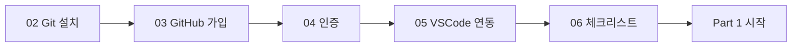

# 00-01. 시작하기 전에

📎 세션 슬라이드 02~06 복습

---

## 우리가 왜 이걸 배우나요

여러분은 곧 4~5명이 한 팀이 되어 4주짜리 프로젝트를 굴리게 됩니다.
세션에서 봤던 그 장면들 — 카톡에 쌓이는 `최종.py`, `진짜_최종.py` 들, 두 디렉토리에 똑같은 이름으로 존재하는 파일들 — 이 진짜로 일어나면 팀이 멈춰요.

이걸 깔끔하게 해결해주는 게 **Git**과 **GitHub** 입니다.

| | 무엇인가요 | 어디서 동작하나요 |
| --- | --- | --- |
| **Git** | 코드의 버전을 줄 단위로 기록·관리하는 도구 | 내 컴퓨터 (로컬) |
| **GitHub** | 그 코드를 클라우드에 올려 팀과 공유·리뷰·머지하는 플랫폼 | 클라우드 |

세션에서 이미 다 들었지만 한 줄 만큼만: **Git은 버전 관리, GitHub은 협업.**

---

## 이 자료를 어떻게 펴볼까요

자료는 **흐름**으로 짜여 있어요. 막힘없이 따라가도 되고, 필요한 부분만 펴봐도 됩니다.

- **[00 환경 세팅](./)** — 도구를 설치하고 손에 쥐어요. 한 번만 하면 끝.
- **[01 한 사이클 혼자 돌려보기](../01-한사이클-혼자-돌려보기/)** — 팀에 합류하기 전에 협업 사이클을 혼자서 처음부터 끝까지 한 번 굴려봐요.
- **[02 팀과 같이 쓰기](../02-팀과-같이-쓰기/)** — 팀 레포 셋업, PR 리뷰, 충돌 해결.
- **[03 자주 막히는 순간](../03-자주-막히는-순간/)** — 프로젝트 굴리다 막히면 펴봐요.

---

## 준비물

- 노트북 (macOS 또는 Windows 10/11)
- 사용 가능한 이메일 1개 — 4주 동안 계속 접근 가능한 메일을 권장합니다 (학교 메일도 OK)
- VSCode 설치 권장 — [code.visualstudio.com](https://code.visualstudio.com/) 에서 무료 다운로드
- 30~50분 정도의 집중 시간

> 💡 회사 노트북·학교 공용 PC를 쓰는 경우, 관리자 권한 / 인터넷 방화벽 / 프록시 때문에 막힐 수 있습니다.
> 각 챕터의 **🩺 막힐 때** 박스에 우회 방법을 적어뒀어요.

---

## 환경 세팅 한눈에 보기

각 챕터 끝에는 **✅ 체크포인트**가 있어요. 다 체크되면 다음으로 넘어가시면 됩니다.

---

## 혹시 막혔을 때

설치·세팅에서 막히는 분이 가장 많아요. 막혔다고 자료를 덮지 마시고:

1. 먼저 챕터 안의 **🩺 막힐 때** 박스를 펴보세요.
2. 그래도 안 되면 에러 메시지를 그대로 복사해서 멘토에게 공유해주세요. (스크린샷보다 텍스트가 빨라요.)
3. **절대 피해야 할 우회 방법** — `sudo rm -rf` 같은 명령을 인터넷에서 복사해 붙여넣지 마세요. 환경이 더 망가질 수 있어요.

준비가 됐다면 [**다음: 02 Git 설치 →**](./02-git-설치.md)

---

### 💡 한 줄 요약

Git은 내 컴퓨터의 버전 관리 도구, GitHub은 그걸 클라우드에서 같이 쓰는 협업 플랫폼. 환경 세팅에서 막히면 멘토에게 에러 메시지 텍스트를 그대로 공유하세요.

### 📚 더 깊이 보기

- 위키독스 — *1.1 Git 소개* (분산 vs 중앙집중, Git의 역사)
- Pro Git — *§1.1 버전 관리란?* / *§1.2 짧게 보는 Git의 역사* → [git-scm.com/book/ko/v2](https://git-scm.com/book/ko/v2)
