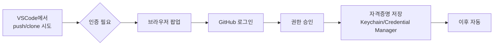

# 00-04. 인증 — 내 컴퓨터 ↔ GitHub 연결

📎 GitHub은 2021년 8월부터 HTTPS 비밀번호 인증을 막았어요. 토큰이나 OAuth 같은 안전한 방식으로 인증해야 합니다.
이 자료에서는 **VSCode + Git Credential Manager (GCM)** 의 자동 인증을 표준 경로로 갑니다 — 한 번 로그인하면 4주 동안 다시 묻지 않아요.

---

## 인증, 한눈에 보기



여러분이 할 일은 **딱 한 번 로그인 + 권한 승인 클릭** 입니다.

---

## 1. 자격 증명 도구 확인

좋은 소식: 거의 모든 분이 이미 깔려 있어요.

**macOS:** Git이 기본으로 macOS Keychain을 자격 증명 저장소로 씁니다. 별도 설치 X.

```bash
$ git config --global credential.helper
osxkeychain
```

**Windows:** Git for Windows 인스톨러 13단계에서 **Git Credential Manager** 를 권장 옵션으로 골랐다면 이미 깔려 있어요.

```bash
$ git config --global credential.helper
manager     # 또는 manager-core
```

> 💡 위 명령어가 **빈 값**을 출력하면 자격 증명 도구가 없는 상태입니다. → [🩺 막힐 때 — 자격 증명 도구 없음](#-막힐-때) 박스 참고.

---

## 2. 표준 동선 — VSCode로 한 번에 끝내기

가장 빠르고 쉬운 길은 VSCode를 통해 첫 GitHub 작업을 시도하는 것입니다. VSCode가 알아서 브라우저를 열어 OAuth 인증을 안내해줘요.

### 동선

1. VSCode를 띄우고, GitHub의 어느 레포든 clone 시도합니다. 시작 화면에 **Clone Git Repository** 클릭.
   - 또는 명령 팔레트 (macOS `Cmd+Shift+P` / Windows `Ctrl+Shift+P`) → `Git: Clone`
2. 임시 테스트용으로 GitHub의 본인 레포 URL 또는 공식 레포 URL을 붙여넣어보세요. 예:
   ```
   https://github.com/octocat/Hello-World.git
   ```
3. 폴더 선택 → 첫 clone이라면 **브라우저 팝업**이 자동으로 뜹니다.
4. GitHub 로그인 페이지에서 로그인 → **Authorize Visual Studio Code** 클릭.
5. 브라우저가 "이 페이지로 돌아가도 됩니다" 라고 알려주면 끝. VSCode가 자동으로 인증 완료를 인식합니다.

이제부터 `git push`, `git pull`, `git clone` 어디서든 자동으로 인증돼요.

### 인증 됐는지 확인

VSCode 좌측 하단의 사람 모양 아이콘 → "Signed in as **your-username**" 이 보이면 성공.

또는 터미널에서:

```bash
# 인증된 상태에서만 잘 동작
$ git ls-remote https://github.com/octocat/Hello-World.git
```

긴 SHA 목록이 출력되면 인증이 끝난 거예요.

---

## 3. 폴백 — PAT (Personal Access Token)

자동 인증이 어떤 이유로든 안 되는 분만 이쪽으로 오시면 됩니다. (회사망 / VSCode 못 쓰는 환경 / 자동 인증 팝업이 안 뜨는 경우)

### PAT 발급

1. [**github.com/settings/tokens**](https://github.com/settings/tokens) 접속
2. **Generate new token** → **Generate new token (classic)**
3. 설정값:

| 항목 | 권장값 |
| --- | --- |
| **Note** | `bootcamp-2026-laptop` (어디서 쓸 토큰인지 본인이 알아볼 이름) |
| **Expiration** | `90 days` — 부트캠프 기간보다 살짝 길게 |
| **Select scopes** | `repo` 체크 (Full control of private repositories) |

4. **Generate token** 클릭 → **토큰이 한 번만 보입니다.** 바로 복사해서 안전한 곳에 저장 (1Password, 메모장 등). 페이지를 닫으면 다시 못 봐요.

### PAT 사용

처음 `git push` 또는 `git clone` 할 때 터미널이 물어봅니다:

```
Username for 'https://github.com': your-username
Password for 'https://your-username@github.com': (여기에 PAT 붙여넣기)
```

이때 비밀번호 칸에는 GitHub 비밀번호가 아니라 **PAT를 붙여넣어야** 합니다.
한 번 입력하면 Credential Manager가 저장하기 때문에 다음부터는 안 물어봐요.

> ⚠️ PAT는 비밀번호와 동급입니다. 코드·문서·Slack에 절대 노출하지 마세요. 노출됐다면 즉시 [github.com/settings/tokens](https://github.com/settings/tokens) 에서 **Revoke** 후 새로 발급.

---

## 4. SSH는?

SSH 키 인증도 가능합니다만 **이 자료는 다루지 않아요.** 부트캠프 4주에는 위 두 방식으로 충분하고, SSH는 초기 설정이 한 단계 더 있고 막혔을 때 디버깅이 어려워요.

SSH가 궁금하시면 아래 "더 깊이 보기" 박스 참고.

---

## 🩺 막힐 때

<details>
<summary><b>VSCode 브라우저 팝업이 안 떠요</b></summary>

VSCode 좌측 하단 사람 아이콘 → <b>Sign in to GitHub</b> 또는 명령 팔레트에서 <code>GitHub: Sign in</code> 직접 호출.

여전히 안 되면 위 <b>3. 폴백 — PAT</b> 방식으로 가시면 됩니다.

</details>

<details>
<summary><b><code>git config --global credential.helper</code> 가 빈 값을 출력해요</b></summary>

자격 증명 도구가 없는 상태예요. OS별로 한 줄 설정하시면 됩니다.

**macOS:**
```bash
$ git config --global credential.helper osxkeychain
```

**Windows:** Git for Windows를 다시 설치하면서 인스톨러 13단계의 <b>Git Credential Manager</b> 옵션을 꼭 선택하세요. 또는:
```bash
$ git config --global credential.helper manager
```

</details>

<details>
<summary><b><code>remote: Support for password authentication was removed on August 13, 2021.</code></b></summary>

비밀번호 칸에 GitHub 비밀번호를 입력하셨네요. GitHub은 더 이상 비밀번호로 인증을 받지 않아요. 위 <b>3. PAT 발급</b> 단계대로 토큰을 만들어 비밀번호 칸에 PAT을 붙여넣으세요.

</details>

<details>
<summary><b>인증은 됐는데 push가 <code>403 Forbidden</code> 이에요</b></summary>

PAT 권한 부족 또는 만료. <a href="https://github.com/settings/tokens">github.com/settings/tokens</a> 에서 토큰의 <code>repo</code> scope 체크 여부와 만료일 확인. 새로 발급하시고 한 번 더 push 시도하세요. Credential Manager가 새 토큰을 저장합니다.

만약 옛 토큰이 캐시에 끼어 있는 거 같으면:

**macOS:** Keychain Access 앱 → <code>github.com</code> 검색 → 항목 삭제 → 다시 push.

**Windows:** 제어판 → 사용자 계정 → 자격 증명 관리자 → Windows 자격 증명 → <code>git:https://github.com</code> 항목 제거.

</details>

<details>
<summary><b>회사망/프록시 뒤에서 인증이 안 돼요</b></summary>

```bash
$ git config --global http.proxy http://proxy.회사.com:포트
$ git config --global https.proxy http://proxy.회사.com:포트
```

설정 후 다시 시도. 인증서 문제 (<code>SSL certificate problem</code>) 가 같이 나오면 IT 부서에 사내 인증서 설치를 요청하세요. **<code>http.sslVerify false</code> 같은 우회는 절대 하지 마세요** — 보안 위험.

</details>

<details>
<summary><b>2FA 켜둔 상태에서 PAT을 어떻게 쓰나요</b></summary>

2FA와 PAT은 독립적입니다. PAT 발급할 때 한 번만 2FA 코드를 묻고, 이후 push/pull은 PAT만으로 동작해요.

</details>

---

## ✅ 체크포인트

- [ ] VSCode 또는 터미널에서 GitHub 인증 완료
- [ ] 테스트 `git ls-remote https://github.com/octocat/Hello-World.git` 가 SHA 목록을 출력
- [ ] (PAT을 발급한 경우) 토큰을 안전한 곳에 저장
- [ ] 만약 PAT을 쓰는 경우, 만료일을 캘린더에 표시

다 체크되면 [**다음: 05 VSCode 연동 →**](./05-vscode-연동.md)

---

### 💡 한 줄 요약

VSCode로 첫 GitHub 작업을 시도해 브라우저 팝업으로 한 번 로그인 → 끝. 안 되면 PAT (`repo` scope, 90일 만료)을 발급해 비밀번호 칸에 붙여넣기.

### 📚 더 깊이 보기

- GitHub 공식 — [Caching your GitHub credentials in Git](https://docs.github.com/en/get-started/getting-started-with-git/caching-your-github-credentials-in-git)
- GitHub 공식 — [Managing your personal access tokens](https://docs.github.com/en/authentication/keeping-your-account-and-data-secure/managing-your-personal-access-tokens)
- GitHub 공식 — [Connecting to GitHub with SSH](https://docs.github.com/en/authentication/connecting-to-github-with-ssh) (SSH 궁금하신 분만)
- Git Credential Manager — [github.com/git-ecosystem/git-credential-manager](https://github.com/git-ecosystem/git-credential-manager)
- 위키독스 — *부록. PythonAnywhere에서 Git 저장소를 설정하고 GitHub 연동하기* (PAT 설정 부분)
- Pro Git — *§7.14 Credential 저장소* → [git-scm.com/book/ko/v2](https://git-scm.com/book/ko/v2)
