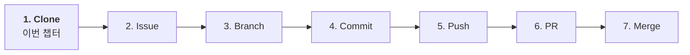

# 01-01. 레포 만들기

📎 세션 슬라이드 10, 11 (Clone)

이번 챕터부터 Part 1이 시작됩니다. 세션의 7단계 다이어그램을 **혼자서 처음부터 끝까지** 한 바퀴 돌려볼 거예요.



이번 챕터에서는 GitHub에 빈 레포를 만들고 내 컴퓨터로 가져옵니다.

---

## 1. GitHub에서 새 레포 만들기

[**github.com/new**](https://github.com/new) 로 이동하시거나, 우상단 `+` 아이콘 → **New repository**.

| 항목 | 권장값 |
| --- | --- |
| **Repository name** | `git-practice-2026` (또는 본인이 알아볼 이름. 영문 소문자·하이픈 권장) |
| **Description** (선택) | "테코 부트캠프 Git 실습용" 같은 한 줄 |
| **Public / Private** | **Public** — 학습 기록이 외부에도 보여 이력서 자산이 됩니다. 민감 정보 없는 실습 레포는 Public이 정답 |
| **Add a README file** | ✅ 체크 |
| **Add .gitignore** | 사용 언어 템플릿 선택 (예: `Node`, `Python`) — 다음 챕터에서 다룰 거예요. 일단 자기 언어 선택 |
| **Choose a license** | `MIT License` 가 가장 일반적이고 안전한 선택 |

**Create repository** 클릭.

화면이 새 레포로 이동하고 README, .gitignore, LICENSE 파일이 보입니다.

> 💡 **Public vs Private 한 줄 정리:** 회사 코드·실제 비밀 키가 없는 **학습 레포는 항상 Public**. 회사 인턴 코드·민감 데이터는 Private. 헷갈리면 Public.

---

## 2. clone — 내 컴퓨터로 가져오기

레포 페이지 우측 초록색 **Code** 버튼 클릭 → **HTTPS** 탭 → URL 복사. 모양:

```
https://github.com/내-username/git-practice-2026.git
```

터미널에서 적당한 작업 디렉토리로 이동 후 clone:

```bash
$ cd ~/work          # 본인의 작업 폴더 (없으면 mkdir로 만드세요)
$ git clone https://github.com/내-username/git-practice-2026.git
Cloning into 'git-practice-2026'...
remote: Enumerating objects: 5, done.
...
$ cd git-practice-2026
```

이게 세션 슬라이드 10의 **Clone** 단계입니다. 원격 저장소를 내 로컬로 통째로 복사해오는 것.

### 동작 확인

```bash
$ ls -la
total 24
drwxr-xr-x   6 me  staff   192 Jun 24 21:00 .
drwxr-xr-x   8 me  staff   256 Jun 24 21:00 ..
drwxr-xr-x  12 me  staff   384 Jun 24 21:00 .git      ← 👈 Git이 관리하는 메타데이터
-rw-r--r--   1 me  staff   123 Jun 24 21:00 .gitignore
-rw-r--r--   1 me  staff  1071 Jun 24 21:00 LICENSE
-rw-r--r--   1 me  staff    50 Jun 24 21:00 README.md
```

`.git` 폴더가 보이면 Git이 이 폴더를 추적 중이라는 뜻이에요. **`.git` 폴더는 절대 손대지 마세요.** 안에 있는 Git의 모든 히스토리·설정이 들어 있어요.

원격 저장소가 잘 연결됐는지:

```bash
$ git remote -v
origin  https://github.com/내-username/git-practice-2026.git (fetch)
origin  https://github.com/내-username/git-practice-2026.git (push)
```

`origin` 이 GitHub의 우리 레포를 가리키면 OK.

---

## 3. VSCode로 열기

```bash
$ code .
```

VSCode가 이 폴더를 열어요. 좌측 사이드바에서 README.md, LICENSE, .gitignore가 보이면 성공.

Source Control 패널 (가지 모양)을 열어보면 좌측 하단에 현재 브랜치가 **`main`** 으로 표시돼요.

---

## 4. (참고) clone vs init — 언제 무엇을 쓰나요

| 명령 | 언제 |
| --- | --- |
| **`git clone <URL>`** | **GitHub에 이미 만들어둔 레포를 가져올 때** (이번 챕터) |
| **`git init`** | 내 컴퓨터에 이미 코드가 있고 그걸 Git으로 관리 시작할 때 (예: `mkdir new-project && cd new-project && git init`) |

부트캠프 4주에서는 거의 **clone**만 쓰게 될 거예요. 팀 레포는 한 명이 만들고 나머지가 clone해서 함께 작업하는 구조입니다.

---

## 🩺 막힐 때

<details>
<summary><b><code>fatal: Authentication failed</code> 에러가 떠요</b></summary>

인증이 안 된 상태입니다. <a href="../00-환경세팅/04-인증.md">04 인증</a> 챕터로 돌아가 VSCode 인증을 마치고 다시 시도하세요. Public 레포라면 인증 없이도 clone되니, Private 레포에 인증 안 된 상태로 접근한 게 아닌지도 확인.

</details>

<details>
<summary><b><code>fatal: destination path '...' already exists and is not an empty directory</code></b></summary>

같은 이름의 폴더가 이미 있어요. 다른 폴더로 이동해서 다시 clone하시거나, 기존 폴더를 다른 이름으로 바꾸시고 진행.

</details>

<details>
<summary><b>clone은 됐는데 <code>.git</code> 폴더가 안 보여요</b></summary>

숨김 폴더라 기본 보기에서는 숨겨져 있어요. macOS Finder는 <code>Cmd+Shift+.</code>, Windows 탐색기는 "보기 → 숨김 항목" 체크로 보이게 할 수 있어요. 터미널에서는 <code>ls -la</code> 로 확인.

</details>

<details>
<summary><b>회사 노트북에서 clone이 SSL 에러를 내요</b></summary>

회사 프록시·인증서 문제. <a href="../00-환경세팅/04-인증.md">04 인증</a> 의 막힐 때 박스 참고. <code>http.sslVerify false</code> 는 절대 쓰지 마세요.

</details>

---

## ✅ 체크포인트

- [ ] GitHub에 레포가 보임 (`github.com/내-username/git-practice-2026`)
- [ ] 내 컴퓨터에 레포 폴더가 있고, 안에 `.git`, `README.md`, `.gitignore`, `LICENSE` 가 있음
- [ ] `git remote -v` 가 `origin` 을 출력
- [ ] VSCode에서 폴더가 열림, Source Control 패널의 브랜치가 `main`

[**다음: 02 .gitignore와 .env →**](./02-gitignore-와-env.md)

---

### 💡 한 줄 요약

GitHub에서 New repository → README/.gitignore/license 옵션 체크 → `git clone <URL>` 로 내 컴퓨터에 복사.

### 📚 더 깊이 보기

- GitHub 공식 — [Cloning a repository](https://docs.github.com/en/repositories/creating-and-managing-repositories/cloning-a-repository)
- GitHub 공식 — [Licensing a repository](https://docs.github.com/en/repositories/managing-your-repositorys-settings-and-features/customizing-your-repository/licensing-a-repository)
- 위키독스 — *5.3.1 로컬 저장소를 새로 만들고 깃허브에 push*, *5.3.2 저장소의 라이선스*
- Pro Git — *§2.1 Git 저장소 만들기* → [git-scm.com/book/ko/v2](https://git-scm.com/book/ko/v2)
