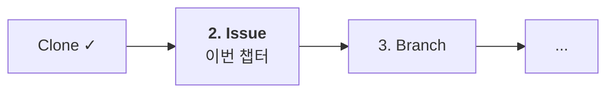

# 01-03. Issue 만들기

📎 세션 슬라이드 16 (Issue)

코드를 짜기 전에 **"나 이거 할게요"** 라고 공식으로 선언하는 단계예요. GitHub의 Issue는 단순 TODO가 아니라 **할 일의 단위 + 토론 공간 + 진척 추적기** 를 다 합친 것입니다.



---

## 1. 왜 Issue를 먼저?

직접 코드부터 짜면 안 되나요? 됩니다. 하지만 팀이 4주 동안 굴러가려면 Issue가 **세 가지 역할**을 해줘요.

| 역할 | 무엇 |
| --- | --- |
| 📝 **할 일 단위** | "로그인 폼 만들기" 같은 한 덩어리의 작업을 명확히 정의 |
| 💬 **토론 공간** | 구현 전에 멘토·팀원과 접근 방식을 논의. 댓글로 기록 남음 |
| 📊 **진척 추적** | 누가 무엇을 / 언제까지 / 지금 어디까지 했는지 한눈에 |

Branch · Commit · PR 모두 Issue 번호를 매달면 자동으로 연결돼요 (이건 다음 챕터들에서).

---

## 2. 실습 — 첫 Issue 만들기

내 실습 레포 (`github.com/내-username/git-practice-2026`) 페이지로 이동.

상단 탭 중 **Issues** 클릭 → **New issue** 클릭.

### Issue 본문 — 3섹션 템플릿

이 자료에서 권장하는 가장 단순한 템플릿이에요. 복사해서 쓰시면 됩니다.

```markdown
## TODO
- [ ] README에 자기소개 섹션 추가
- [ ] 좋아하는 책 3권 적기
- [ ] 4주 동안의 목표 한 줄

## 완료 기준
- README.md 가 위 3개 항목을 포함한다
- PR이 main에 머지된다

## 참고
- README는 markdown 문법으로 작성
- [GitHub Flavored Markdown 가이드](https://guides.github.com/features/mastering-markdown/)
```

### 제목 (Title)

| 좋은 예 | 나쁜 예 |
| --- | --- |
| `feat: README에 자기소개 섹션 추가` | `자기소개` (너무 모호) |
| `fix: 로그인 폼 제출 시 빈 값 검증` | `버그 수정` (어느 버그?) |
| `docs: 환경 변수 설정 가이드 추가` | `문서 수정` (어느 문서?) |

**prefix (`feat:`, `fix:`, `docs:`)** 는 다음 챕터의 커밋 컨벤션과 통일하는 게 좋아요. 일관성이 핵심.

### Submit

**Submit new issue** 클릭. 첫 Issue가 만들어졌어요. 번호가 부여됩니다 — 예: `#1`.

---

## 3. 라벨 · Assignee · Projects 한 번씩

Issue 우측 사이드바에 옵션이 있어요. 각자 한 번씩 클릭해보세요.

### Labels

분류 태그입니다. 기본으로 깔린 라벨:

| 라벨 | 언제 |
| --- | --- |
| `bug` | 버그 리포트 |
| `documentation` | 문서 관련 |
| `enhancement` | 기능 추가/개선 |
| `good first issue` | 처음 기여하는 사람용 |
| `help wanted` | 도움 필요 |
| `question` | 질문 |

방금 만든 Issue에 `enhancement` 또는 `documentation` 라벨을 달아보세요.

> 💡 부트캠프 팀에서는 이걸 그대로 쓰거나, `feat`/`fix`/`refactor` 같이 커밋 컨벤션과 통일된 라벨을 새로 만드는 것도 좋아요. Part 2에서 다룹니다.

### Assignees

이 Issue를 담당할 사람. 본인을 Assign 해보세요 — **Assign yourself** 링크.

### Projects

GitHub Projects는 칸반 보드 같은 것이에요. 이번 실습에서는 안 써도 됩니다. 팀 프로젝트에서는 유용해요.

---

## 4. (참고) Issue 상태와 닫기

Issue는 **Open** (열림) / **Closed** (닫힘) 두 상태가 있어요.

- 작업 중 → Open
- 작업 완료 → Closed

직접 **Close issue** 버튼으로 닫을 수도 있고, **PR 본문에 `Closes #1` 이라고 적으면 머지될 때 자동으로 닫혀요.** 이게 세션 슬라이드 18b에서 본 그 동작입니다. PR 챕터(01-05)에서 한 번 더 다룹니다.

---

## 5. 좋은 Issue 작성 팁

- **한 Issue = 한 작업 단위.** "로그인 + 회원가입 + 비밀번호 찾기" 처럼 묶지 마세요. PR이 거대해져 리뷰 불가능.
- **완료 기준을 체크박스로** (`- [ ]`). 진행률이 GitHub에 시각화돼요.
- **재현 절차 / 기대 결과 / 실제 결과** — 버그 리포트일 때 이 3개를 적으면 멘토·팀원이 빠르게 도와줄 수 있어요.
- **스크린샷 / 에러 로그** — 텍스트로 붙여넣기. 이미지는 드래그&드롭으로 첨부 가능.

---

## 6. 실습 — Issue 하나 더

같은 방식으로 두 번째 Issue를 만들어보세요. 예시:

- 제목: `docs: 프로젝트 소개 README 정리`
- 본문 3섹션 그대로
- 라벨: `documentation`
- Assignee: 본인

체크리스트에 "Issue 2개 보유" 가 있어서 두 번째도 필요해요. (이 두 Issue 가 곧 Part 1의 두 PR이 됩니다.)

---

## 🩺 막힐 때

<details>
<summary><b>Issue 탭이 안 보여요</b></summary>

레포 설정에서 비활성화된 경우. 레포 페이지 → <b>Settings</b> → <b>General</b> → <b>Features</b> → <b>Issues</b> 체크.

</details>

<details>
<summary><b>마크다운 미리보기가 안 돼요</b></summary>

Issue 본문 입력칸 상단의 <b>Preview</b> 탭을 클릭하시면 됩니다.

</details>

<details>
<summary><b>Issue 번호가 #1이 아닌데요</b></summary>

이미 다른 Issue/PR이 있었을 수 있어요. GitHub은 Issue와 PR 번호를 공유합니다 — Issue가 <code>#1</code> 이면 다음 PR은 <code>#2</code> 가 돼요. 본인 레포의 실제 번호를 사용하시면 됩니다.

</details>

---

## ✅ 체크포인트

- [ ] Issue를 2개 만들었음
- [ ] 각 Issue에 제목 prefix (`feat:` / `docs:` 등) 부여
- [ ] 본문에 TODO / 완료 기준 / 참고 3섹션 포함
- [ ] 본인을 Assignee로 지정
- [ ] 라벨 1개 이상 부착

[**다음: 04 Branch와 커밋 →**](./04-branch-와-커밋.md)

---

### 💡 한 줄 요약

코드 짜기 전에 Issue부터. 한 작업 = 한 Issue, 본문은 TODO/완료 기준/참고 3섹션, 제목엔 컨벤션 prefix.

### 📚 더 깊이 보기

- GitHub 공식 — [About issues](https://docs.github.com/en/issues/tracking-your-work-with-issues/about-issues)
- GitHub 공식 — [Creating an issue](https://docs.github.com/en/issues/tracking-your-work-with-issues/creating-an-issue)
- GitHub Flavored Markdown — [github.github.com/gfm](https://github.github.com/gfm/)
- 위키독스 — *6. 협업* — Issue와 PR의 차이
