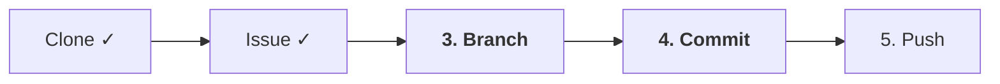
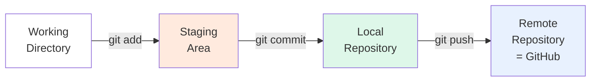

# 01-04. Branch와 커밋

📎 세션 슬라이드 07, 15, 15b (브랜치 · 커밋 메시지 · Branch)

세션의 7단계 중 **3·4단계(Branch · Commit)** 를 한 번에 다룹니다. 둘이 짝꿍이라 같이 봐야 흐름이 매끄러워요.



---

## 1. Branch — 왜 가지를 뻗나요

세션 슬라이드 07의 나무 비유를 다시 한 번. `main` 이라는 줄기로부터 작업할 때마다 **가지(branch)** 를 뻗습니다. 가지에서 자유롭게 코드를 짜다가, 다 되면 다시 줄기로 합쳐요 (Merge).

### 왜 branch를 만들까요?

- ✅ **main을 깨끗하게** — main에는 동작이 검증된 코드만. 작업 중인 미완성 코드는 가지에서.
- ✅ **여러 작업 병렬** — 팀원 A가 로그인 작업하는 동안 팀원 B는 회원가입을 동시에.
- ✅ **언제든 안전하게 폐기** — 작업이 마음에 안 들면 가지 통째로 버리고 다시.

---

## 2. 실습 — branch 만들기

01-03에서 만든 첫 번째 Issue 번호를 기억하시죠? `#1` 이라고 가정합니다.

### 현재 어디 있는지 확인

```bash
$ git branch
* main
```

`*` 표시가 현재 브랜치예요. 지금은 `main` 에 있어요.

### 새 branch 만들고 그쪽으로 이동

```bash
$ git switch -c feat/#1-self-intro
Switched to a new branch 'feat/#1-self-intro'
```

| 명령 | 무엇인가요 |
| --- | --- |
| `git switch -c <이름>` | 새 브랜치를 만들면서 그쪽으로 이동 (`-c` = create) |
| `git switch <이름>` | 이미 있는 브랜치로 이동만 |
| `git branch <이름>` | 만들기만 하고 이동은 안 함 (잘 안 씀) |

> 💡 **옛날 명령어 `git checkout -b feat/#1-self-intro` 도 같은 동작입니다.** `checkout` 이 워낙 여러 일을 해서 헷갈리게 만들어, 2019년부터 `switch` (브랜치 이동) / `restore` (파일 복원) 가 새로 생겼어요. 둘 중 어느 쪽을 써도 됩니다.

### 잘 옮겨졌는지 확인

```bash
$ git branch
* feat/#1-self-intro
  main
```

VSCode를 보고 있다면 좌측 하단 상태바의 브랜치 이름이 바뀌었을 거예요.

---

## 3. Branch 네이밍 컨벤션

이 자료 권장 패턴:

```
<type>/#<이슈번호>-<짧은-설명>
```

예시:

| Type | 의미 | 예시 |
| --- | --- | --- |
| `feat` | 새 기능 | `feat/#1-self-intro` |
| `fix` | 버그 수정 | `fix/#5-login-validation` |
| `docs` | 문서 | `docs/#3-api-readme` |
| `refactor` | 동작 그대로, 코드 정리 | `refactor/#8-extract-utils` |
| `test` | 테스트 추가/수정 | `test/#10-auth-spec` |
| `chore` | 빌드/설정/기타 | `chore/#12-update-deps` |

### 왜 이런 규칙을?

- `type` 으로 한눈에 작업 성격 파악
- `#이슈번호` 로 어느 Issue 와 연결됐는지 즉시 추적
- 짧은 설명으로 어떤 작업인지 힌트

> 💡 부트캠프 팀에서 `feat_#1_self_intro` 같이 다른 변형을 합의해도 됩니다. **팀 안에서 통일**되는 게 핵심.

자세한 패턴은 [부록 C 브랜치 네이밍 한 장](../부록/C-브랜치-네이밍-한-장.md) 참고.

---

## 4. Commit — 사진 한 컷씩 찍기

세션 슬라이드 13~14를 다시 떠올려보세요. 코드의 변경사항이 영구 기록되려면 **4단계의 영역을 거쳐야** 합니다.



| 영역 | 무엇 |
| --- | --- |
| **Working Directory** | 실제 파일이 있는 곳. 코드 편집 중인 상태 |
| **Staging Area** | 사진 찍을 영역. "이번 커밋에 이 변경들을 포함시킬 거야" 라고 표시한 곳 |
| **Local Repository** | 커밋된 사진들이 쌓이는 내 컴퓨터의 저장소 |
| **Remote (GitHub)** | 클라우드. 팀이 공유하는 진짜 저장소 |

이번 챕터에서는 Working → Staging → Local 까지. Push는 다음 챕터.

### 실습 — README 수정 후 커밋

VSCode에서 `README.md` 를 열어 자기소개를 추가해보세요.

```markdown
# git-practice-2026

테코 부트캠프 2026 Git 실습용 레포.

## 안녕하세요

- 이름: 이정 (Leo)
- 좋아하는 책: 클린 코드, 함수형 사고, ...
- 4주 동안의 목표: PR 30개 보내기
```

저장. 이제 터미널로:

```bash
$ git status
On branch feat/#1-self-intro
Changes not committed:
  modified:   README.md

no changes added to commit (use "git add" ...)
```

`modified: README.md` 가 보이면 Working Directory 의 변경을 Git이 감지한 상태입니다.

### 4-1. `git add` — Staging 으로 올리기

```bash
$ git add README.md
$ git status
On branch feat/#1-self-intro
Changes to be committed:
  modified:   README.md
```

`Changes to be committed` 로 옮겨졌어요. 이게 Staging Area.

> 💡 **여러 파일을 한 번에:** `git add .` 은 현재 폴더 이하의 모든 변경을 Staging. 단 `.gitignore` 에 들어 있는 파일은 자동 제외돼요.

### 4-2. `git commit` — 사진 찍기

```bash
$ git commit -m "docs: README에 자기소개 추가"
[feat/#1-self-intro 4f2c1ab] docs: README에 자기소개 추가
 1 file changed, 5 insertions(+)
```

이 한 줄이 커밋 메시지예요. 다음 섹션이 가장 중요합니다.

### 4-3. 잘 됐는지 확인

```bash
$ git log --oneline
4f2c1ab (HEAD -> feat/#1-self-intro) docs: README에 자기소개 추가
a1b2c3d (origin/main, main) Initial commit
```

방금 만든 커밋이 가장 위에 보입니다.

---

## 5. 커밋 메시지 컨벤션 — Conventional Commits

세션 슬라이드 15에서 본 그 패턴이에요. 이 자료 권장:

```
<type>: <한 줄 요약 50자 이내>

[필요하면 본문 — 무엇을, 왜]
```

### Type 7종

| Type | 언제 |
| --- | --- |
| `feat` | 새 기능 추가 |
| `fix` | 버그 수정 |
| `docs` | 문서만 변경 (README, 주석 등) |
| `style` | 동작 변화 없는 포맷 (공백, 세미콜론, 들여쓰기) |
| `refactor` | 동작 그대로, 구조 개선 |
| `test` | 테스트 추가/수정 |
| `chore` | 빌드·설정·의존성 (`package.json`, `.github/`) |

### 좋은 메시지 vs 나쁜 메시지

| 좋은 예 ✅ | 나쁜 예 ❌ |
| --- | --- |
| `feat: 로그인 폼 추가` | `update` |
| `fix: 비밀번호 빈 값 제출 시 alert` | `버그 수정` |
| `docs: README에 환경 변수 설정 추가` | `readme 수정` |
| `refactor: AuthService 를 클래스로 분리` | `리팩토링` |
| `chore: ESLint 규칙에 no-console 추가` | `ㅋㅋ` |

### 본문이 필요할 때

복잡한 변경은 두 줄짜리 본문을 추가해요. 첫 줄(요약)과 본문 사이에 **빈 줄 하나**.

```
feat: 로그인 폼 추가

- 이메일·비밀번호 필드 추가
- 빈 값 제출 시 인라인 에러
- 제출 후 /dashboard 로 라우팅
```

터미널에서 본문 쓰려면 `git commit` 만 입력 (`-m` 없이). 에디터가 열려요.

### 한국어 vs 영어

둘 다 OK. **팀 안에서 통일**만 하면 돼요. 부트캠프 팀이 한국 멘티들이면 한국어 권장. 오픈소스 기여라면 영어.

자세한 가이드는 [부록 B 커밋 컨벤션 한 장](../부록/B-커밋-컨벤션-한-장.md) 참고.

---

## 6. 작은 커밋 vs 큰 커밋

한 커밋에 너무 많은 걸 담지 마세요. **하나의 커밋 = 하나의 논리적 변경**이 원칙.

| 좋은 예 ✅ | 나쁜 예 ❌ |
| --- | --- |
| `feat: 로그인 폼 마크업` + `feat: 로그인 폼 검증 로직` + `style: 로그인 폼 정렬` (3개 커밋) | `feat: 로그인` (마크업 + 검증 + 스타일 + 라우팅 모두 한 번에) |

리뷰어가 작은 커밋 5개를 읽기는 쉽지만, 거대한 커밋 하나는 리뷰가 거의 불가능해요.

> 💡 **현실 팁:** 작업 중에는 작게 자주 커밋하고, PR 머지할 때 Squash로 묶어서 main에는 깔끔한 한 줄로 남기는 패턴이 가장 흔합니다. (01-06 Merge 챕터에서 다룸)

---

## 7. 두 번째 Issue 작업도 같은 방식

01-03에서 만든 두 번째 Issue(`#2 docs: 프로젝트 소개 README 정리`)도 똑같이 해봅시다.

```bash
$ git switch main          # 줄기로 돌아가서
$ git pull                 # 혹시 모를 최신 변경 반영
$ git switch -c docs/#2-project-intro
```

작업 → add → commit → 다음 챕터에서 push.

> ⚠️ **흔한 실수:** `feat/#1` 브랜치에서 안 빠져나오고 새 작업까지 같은 브랜치에서 진행. 그러면 PR 하나에 두 작업이 섞여요. **새 작업 = 새 브랜치 (main 에서 분기)** 가 원칙.

---

## 🩺 막힐 때

<details>
<summary><b>커밋 메시지에 오타를 냈어요</b></summary>

**아직 push 안 한 경우** — 마지막 커밋만 수정:

```bash
$ git commit --amend -m "올바른 메시지"
```

**이미 push한 경우** — 그대로 두고 다음 커밋부터 잘 쓰세요. 푸시 후 amend는 위험합니다 (히스토리 재작성).

</details>

<details>
<summary><b><code>git add</code> 했는데 빼고 싶어요</b></summary>

```bash
$ git restore --staged <파일>
# 또는 옛 명령: git reset HEAD <파일>
```

</details>

<details>
<summary><b><code>git commit</code> 했더니 에디터가 떴는데 빠져나오는 법을 모르겠어요</b></summary>

Vim 화면이면:
1. <code>Esc</code> 키
2. <code>:wq</code> 입력 후 Enter (저장하고 종료)

다음부터 <code>git commit -m "..."</code> 처럼 <code>-m</code> 으로 메시지를 미리 주면 에디터 안 열려요.

기본 에디터를 바꾸려면:
```bash
$ git config --global core.editor "code --wait"   # VSCode
```

</details>

<details>
<summary><b>잘못된 브랜치에서 커밋했어요</b></summary>

당황하지 마세요. 안전한 길이 있습니다.

```bash
# 현재 브랜치에서 변경을 임시 보관
$ git reset --soft HEAD~1   # 마지막 커밋만 풀어내기 (변경은 유지)
$ git stash                  # 보관
$ git switch <올바른-브랜치>
$ git stash pop              # 다시 꺼내기
# 이제 add + commit
```

자세한 건 [3-01 FAQ #3](../03-자주-막히는-순간/01-faq.md) 참고.

</details>

---

## 🧪 점검 퀴즈

다음으로 넘어가기 전 4문항. 헷갈리면 본문 해당 절을 다시 펴보세요.

**Q1.** 새 브랜치 `feat/#3-signup` 을 만들면서 동시에 그쪽으로 이동하려면?

- (A) `git branch feat/#3-signup`
- (B) `git switch feat/#3-signup`
- (C) `git switch -c feat/#3-signup`
- (D) `git checkout feat/#3-signup`

<details><summary>정답</summary>

**(C)** `git switch -c <이름>`. `-c` 가 create. (D) 의 옛 명령 `git checkout -b feat/#3-signup` 도 같은 동작이지만, 이 자료는 `switch` 로 통일.

</details>

**Q2.** 다음 중 좋은 커밋 메시지는?

- (A) `update`
- (B) `feat: 로그인 폼 + 회원가입 + 비밀번호 찾기`
- (C) `feat: 로그인 폼 추가`
- (D) `로그인 추가함.`

<details><summary>정답</summary>

**(C)**. type 명시 + 한 가지 논리적 변경 + 50자 이내 + 마침표 없음.
- (A) type·내용 모두 부족
- (B) 한 커밋에 세 작업 → 너무 큼
- (D) type 누락, 마침표 존재

</details>

**Q3.** `git add README.md` 한 직후 그 파일이 들어가는 영역은?

- (A) Working Directory
- (B) Staging Area
- (C) Local Repository
- (D) Remote Repository

<details><summary>정답</summary>

**(B) Staging Area.** `git status` 의 `Changes to be committed` 섹션에서 확인할 수 있어요. commit 하면 (C) Local Repository 로, push 하면 (D) Remote 로 이동.

</details>

**Q4.** `git add` 를 잘못해서 `.env` 가 staging 에 올라갔어요. 안전하게 빼려면?

- (A) `git restore --staged .env`
- (B) `git rm .env`
- (C) `git reset --hard`
- (D) `.env` 파일을 그냥 삭제

<details><summary>정답</summary>

**(A)** `git restore --staged .env`. 파일 내용은 그대로, stage 에서만 빠집니다. (B) 는 디스크에서도 삭제, (C) 는 모든 변경 영구 손실 ⚠️, (D) 는 stage 에 이미 올라간 상태를 못 풀어요. 자세한 비교는 [03-03 #3](../03-자주-막히는-순간/03-명령어-사전.md#3-stage-에서-빼기--작업-되돌리기).

</details>

---

## ✅ 체크포인트

- [ ] 첫 Issue용 branch (`feat/#1-...`) 생성 및 이동
- [ ] README.md 수정 후 `git add` → `git commit`
- [ ] 커밋 메시지가 컨벤션 (`<type>: <요약>`) 을 따름
- [ ] `git log --oneline` 에서 새 커밋 확인
- [ ] 두 번째 Issue용 브랜치도 생성, 작업, 커밋 완료
- [ ] 위 점검 퀴즈 4문항 모두 정답 확인

[**다음: 05 Push와 PR →**](./05-push-와-pr.md)

---

### 💡 한 줄 요약

`git switch -c <type>/#<이슈번호>-<설명>` 으로 가지 뻗고, `<type>: <요약>` 컨벤션으로 작게 자주 커밋.

### 📚 더 깊이 보기

- [Conventional Commits 공식 (한국어)](https://www.conventionalcommits.org/ko/v1.0.0/)
- GitHub 공식 — [About branches](https://docs.github.com/en/repositories/configuring-branches-and-merges-in-your-repository/managing-branches-in-your-repository)
- 위키독스 — *2.08 브랜치*, *2.8.1 로컬 저장소에서 브랜치 생성·수정·병합*, *2.8.2 master와 main*
- Pro Git — *§3.1 브랜치란 무엇인가*, *§3.2 브랜치와 Merge의 기초* → [git-scm.com/book/ko/v2](https://git-scm.com/book/ko/v2)
