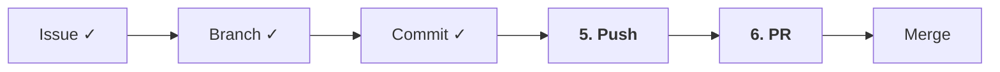

# 01-05. Push와 PR

📎 세션 슬라이드 14, 17 (Push · PR)

세션 7단계 중 **5·6단계**. 내 컴퓨터의 커밋을 GitHub에 올리고(Push), main에 합쳐달라고 요청(PR)합니다.



---

## 1. Push — 원격으로 올리기

지금까지 만든 커밋들은 **내 컴퓨터에만** 있어요. GitHub의 원격 저장소(`origin`)는 아직 모르는 상태.

### 첫 push — `-u` 가 필요한 이유

```bash
$ git push -u origin feat/#1-self-intro
Enumerating objects: 5, done.
...
remote: Create a pull request for 'feat/#1-self-intro' on GitHub by visiting:
remote:      https://github.com/내-username/git-practice-2026/pull/new/feat/#1-self-intro
To https://github.com/내-username/git-practice-2026.git
 * [new branch]      feat/#1-self-intro -> feat/#1-self-intro
Branch 'feat/#1-self-intro' set up to track 'origin/feat/#1-self-intro'.
```

| 옵션 | 의미 |
| --- | --- |
| `git push` | "내 커밋들을 원격으로 올려" |
| `origin` | 원격 저장소 이름 (clone하면 자동으로 `origin` 으로 등록됨) |
| `feat/#1-self-intro` | 올릴 브랜치 이름 |
| `-u` | "이제부터 이 로컬 브랜치 ↔ 원격 브랜치를 짝지어둬" → 다음부터는 그냥 `git push`, `git pull` 만 쳐도 알아서 동작 |

`-u` 는 **새 브랜치 첫 push 때만** 필요합니다. 그다음부터는 `git push` 만 치시면 돼요.

### 동작 확인

GitHub 레포 페이지 새로고침. 상단에 노란 배너가 떠요:

> **`feat/#1-self-intro` had recent pushes. [Compare & pull request]**

이 버튼이 다음 단계 (PR) 의 입구입니다.

---

## 2. PR — Pull Request 올리기

세션 슬라이드 17. **"내 가지를 main에 합쳐주세요"** 라고 요청하는 화면이에요.

위 노란 배너의 **Compare & pull request** 클릭. 또는 레포의 **Pull requests** 탭 → **New pull request** → base/compare 브랜치 선택.

### PR 본문 — 5섹션 템플릿

이 자료 권장 템플릿입니다. 그대로 복붙해서 채우세요.

```markdown
## 요약
README에 자기소개 섹션을 추가했습니다.

## 변경사항
- 자기소개 헤더 추가
- 이름·좋아하는 책·4주 목표 항목 추가

## 테스트
- [x] README 미리보기로 마크다운 렌더링 확인
- [x] 오탈자 확인

## 스크린샷
(GitHub의 Issue/PR 본문에 이미지를 드래그&드롭하면 자동 업로드돼요)

## 관련 이슈
Closes #1
```

### 가장 중요한 한 줄: `Closes #1`

PR 본문에 **`Closes #1`** (또는 `Fixes #1`, `Resolves #1`) 이라고 적으면, 이 PR이 main에 머지될 때 **Issue #1이 자동으로 닫힙니다.**

세션 슬라이드 18에서 본 "사이클이 완전히 종료된다"의 정확한 그 동작이에요.

| 키워드 (다 동일) |
| --- |
| `Closes #1` / `Close #1` |
| `Fixes #1` / `Fix #1` |
| `Resolves #1` / `Resolve #1` |

### PR 제목

Issue 제목과 같은 컨벤션을 씁니다.

```
docs: README에 자기소개 추가 (#1)
```

마지막에 `(#1)` 처럼 이슈 번호를 적어두면 머지 후 히스토리에서도 추적이 쉬워요. Squash 머지(다음 챕터) 시 자동으로 PR 번호가 붙기 때문에 사실 생략 가능. 팀 컨벤션에 맞추시면 됩니다.

### Create pull request

본문 작성 끝나면 초록 버튼 **Create pull request** 클릭.

> 💡 **Draft pull request** — 작성 중인데 미리 공유하고 싶을 때. 머지 버튼이 비활성화돼 사고를 막아줘요. 필요하면 드롭다운에서 선택.

---

## 3. self-review — 혼자라도 댓글 1개

부트캠프 팀에 합류하기 전 연습이니, 지금 PR에는 리뷰어가 없어요. 대신 **본인이 본인 PR에 셀프 리뷰 댓글 1개** 를 달아봅시다. 팀에 합류했을 때 좋은 리뷰 습관이 자연스레 따라옵니다.

### 단계

1. PR 페이지의 **Files changed** 탭 클릭
2. README.md 의 변경된 줄을 클릭
3. 좌측에 나타나는 파란 `+` 아이콘 클릭 → **Add a single comment** (또는 여러 줄 선택해 Add a comment on this line)
4. 댓글 작성. 예:
   - "다음 항목에 GitHub 핸들도 추가하면 좋겠다"
   - "이 줄 마지막에 쉼표가 빠진 듯"
5. **Add single comment** 또는 **Start a review** 로 등록

자기 PR이라 어색할 수 있는데, 정말로 **다른 사람의 PR을 본다는 시선** 으로 1번만 적어보세요.

### 댓글 종류 한눈에

| 종류 | 언제 |
| --- | --- |
| **Comment** | 단순 의견·질문 |
| **Suggestion** (코드 블록 ```` ```suggestion ````) | 이렇게 바꾸는 게 어때요. 상대가 한 클릭으로 적용 가능 |
| **Approve** | 머지해도 좋아요 |
| **Request changes** | 수정 필요. 머지 막을 수 있음 |

자세한 리뷰 에티켓은 [Part 2-04 PR 리뷰 에티켓](../02-팀과-같이-쓰기/04-pr-리뷰-에티켓.md) 에서.

---

## 4. PR 업데이트 — 추가 커밋

PR을 올린 뒤에도 추가 작업이 필요하면 그냥 같은 브랜치에 commit + push 하면 됩니다. **PR 페이지가 자동으로 갱신**돼요.

```bash
# 추가 작업
$ git add README.md
$ git commit -m "docs: GitHub 핸들 추가"
$ git push
```

이제 두 번째 커밋부터는 `-u` 없이 그냥 `git push`.

---

## 5. 두 번째 Issue / PR 도 같은 방식으로

`docs/#2-project-intro` 브랜치도 똑같이.

```bash
$ git switch docs/#2-project-intro
$ git push -u origin docs/#2-project-intro
```

GitHub에서 PR 본문 작성 → `Closes #2` → Create.

이로써 PR 2개 보유 → 체크리스트의 AC2 (b) 항목 충족.

---

## 6. (참고) Push 가 안 될 때 자주 보이는 메시지

### `! [rejected]   feat/#1-self-intro -> feat/#1-self-intro (fetch first)`

원격이 내 로컬보다 앞서 있을 때. 보통 **나 말고 다른 사람이 push 했거나, GitHub 웹에서 직접 수정한 경우**.

처방:

```bash
$ git pull --rebase   # 원격 변경을 가져와 내 커밋을 맨 위로 다시 쌓기
$ git push            # 다시 시도
```

자세한 건 [3-01 FAQ #1](../03-자주-막히는-순간/01-faq.md) 참고.

### `fatal: The current branch ... has no upstream branch`

첫 push 인데 `-u` 를 안 붙였어요. 한 번 더:

```bash
$ git push -u origin feat/#1-self-intro
```

---

## 🩺 막힐 때

<details>
<summary><b>Push가 인증 에러로 안 돼요</b></summary>

<a href="../00-환경세팅/04-인증.md">04 인증</a> 챕터의 막힐 때 박스 참고. 자격 증명이 만료됐을 가능성.

</details>

<details>
<summary><b>PR을 만들었는데 잘못된 base 브랜치를 골랐어요</b></summary>

PR 페이지 상단의 <b>base</b> 드롭다운을 클릭해 올바른 브랜치로 바꿀 수 있어요. PR을 새로 만들 필요 없음.

</details>

<details>
<summary><b>Closes #1을 적었는데 머지해도 Issue가 안 닫혔어요</b></summary>

- PR의 <b>base 브랜치가 main</b> 이 아니면 자동 닫기 안 됨 (예: feature → develop 머지)
- Issue 번호 앞에 `#` 빠짐
- 다른 레포의 이슈 번호 (예: `org/other-repo#1` 형식이 필요)

</details>

<details>
<summary><b>이미 PR을 만들었는데 닫고 싶어요</b></summary>

PR 페이지 하단 <b>Close pull request</b>. 브랜치는 그대로 남고 PR만 닫혀요. 나중에 다시 열고 싶으면 Reopen.

</details>

---

## 🧪 점검 퀴즈

**Q1.** 새 브랜치 첫 push 에 `-u` 옵션을 붙이는 이유는?

- (A) 더 빠르게 push 됨
- (B) 로컬↔원격 브랜치 트래킹을 설정해서 다음부터 `git push` 만 쳐도 됨
- (C) 강제 push (force push)
- (D) 원격에 브랜치를 새로 만드는 데 필요한 권한

<details><summary>정답</summary>

**(B)**. `-u` = `--set-upstream`. 한 번 설정해두면 다음부터 `git push`, `git pull` 만으로 동작. (C) 의 강제 push 는 `-f`/`--force` 로 별개 (그리고 위험 명령).

</details>

**Q2.** PR 본문에 `Closes #15` 라고 적으면?

- (A) Issue #15 가 즉시 닫힘
- (B) PR 이 main 에 머지되는 순간 Issue #15 가 자동 닫힘
- (C) Issue #15 의 라벨이 변경됨
- (D) 아무 일도 안 일어남

<details><summary>정답</summary>

**(B)**. `Closes` / `Fixes` / `Resolves` 셋 다 같은 동작. 단, PR base 가 main(레포 기본 브랜치) 이어야 합니다. 다른 브랜치로 머지하면 자동 닫기 안 됨.

</details>

**Q3.** push 했더니 다음 메시지가 떴어요. 무엇이 원인인가요?

```
! [rejected]   feat/login -> feat/login (fetch first)
```

- (A) 인증 실패
- (B) 보호 룰이 막음
- (C) 원격 같은 브랜치에 내 로컬보다 새로운 커밋이 있음
- (D) 브랜치 이름 오타

<details><summary>정답</summary>

**(C)**. 다른 사람이 같은 브랜치에 push 했거나, GitHub 웹에서 직접 수정한 경우. 처방: `git pull --rebase` 후 다시 `git push`. 자세한 건 [03-01 FAQ #1](../03-자주-막히는-순간/01-faq.md#-1--rejected--fetch-first) 또는 [03-05 #8](../03-자주-막히는-순간/05-에러-메시지-사전.md#8-failed-to-push-some-refs--non-fast-forward--fetch-first).

</details>

**Q4.** 리뷰어가 코드 한 줄을 ` ```suggestion ` 블록으로 제안했어요. PR 작성자가 가장 빠르게 적용하는 방법은?

- (A) 댓글을 보고 로컬에서 직접 같은 변경 후 push
- (B) PR 페이지의 **Commit suggestion** 버튼 한 번
- (C) 새 PR 을 만들기
- (D) 리뷰어에게 직접 권한을 줘서 commit 받기

<details><summary>정답</summary>

**(B)**. Suggestion 의 가장 큰 매력. 자세한 건 [02-04 PR 리뷰 에티켓 — 2. Suggestion 블록](../02-팀과-같이-쓰기/04-pr-리뷰-에티켓.md#2-suggestion-블록--가장-유용한-도구).

</details>

---

## ✅ 체크포인트

- [ ] `feat/#1-self-intro` 브랜치를 push (`-u origin` 으로)
- [ ] PR 1개 생성, 본문에 `Closes #1`
- [ ] PR Files changed 탭에서 셀프 리뷰 댓글 1개 작성
- [ ] `docs/#2-project-intro` 브랜치도 push
- [ ] PR 2개 보유
- [ ] 위 점검 퀴즈 4문항 모두 정답 확인

[**다음: 06 Merge와 이슈 닫기 →**](./06-merge-와-이슈-닫기.md)

---

### 💡 한 줄 요약

`git push -u origin <브랜치>` 로 올리고, PR 본문 5섹션 + `Closes #이슈번호`. 첫 push만 `-u`, 다음부턴 그냥 push.

### 📚 더 깊이 보기

- GitHub 공식 — [About pull requests](https://docs.github.com/en/pull-requests/collaborating-with-pull-requests/proposing-changes-to-your-work-with-pull-requests/about-pull-requests)
- GitHub 공식 — [Linking a pull request to an issue](https://docs.github.com/en/issues/tracking-your-work-with-issues/linking-a-pull-request-to-an-issue)
- GitHub 공식 — [Creating a pull request](https://docs.github.com/en/pull-requests/collaborating-with-pull-requests/proposing-changes-to-your-work-with-pull-requests/creating-a-pull-request)
- 위키독스 — *3.1 원격 저장소 연동*, *3.2 Push와 Pull*, *6. 협업*
- Pro Git — *§2.5 리모트 저장소*, *§6.2 GitHub 프로젝트에 기여하기*
