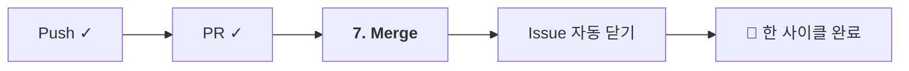

# 01-06. Merge와 이슈 닫기

📎 세션 슬라이드 18, 19 (Merge · 머지 전략 3종)

세션 7단계의 마지막 7단계. PR을 main에 합치고, 연결된 Issue가 자동으로 닫히는 걸 확인합니다.



---

## 1. 머지 전략 3종 — 한눈에

세션 슬라이드 19에서 본 그 3가지예요. GitHub PR 머지 버튼 옆 드롭다운에서 고를 수 있습니다.

| 전략 | 히스토리 모양 | 언제 적합 |
| --- | --- | --- |
| **Create a merge commit** | main에 머지 커밋이 추가됨, 가지의 모든 커밋 그대로 보존 | 큰 기능을 그룹으로 보존하고 싶을 때 |
| **Squash and merge** ⭐ | 가지의 모든 커밋이 **하나로 압축**되어 main에 한 줄로 추가 | **부트캠프 권장**. 깔끔한 main 히스토리 |
| **Rebase and merge** | 가지의 모든 커밋이 main 위에 일직선으로 추가 (머지 커밋 없음) | 작은 단위 커밋을 보존하면서 일직선 히스토리 원할 때 |

### 이번 자료는 — **Squash로 통일**

이유:
- 가지 작업 중에는 **작게 자주 커밋** 하는 게 좋지만 (`wip`, `오타 수정` 등이 섞임)
- main에는 **PR 단위로 깔끔한 한 줄** 만 남기는 게 보기 좋아요
- Squash가 그 둘을 한 번에 해결

부트캠프 팀에서는 Part 2-02 (보호 룰) 의 레포 설정으로 **Squash만 가능하게 강제** 하는 것도 흔합니다.

> 💡 **Rebase의 그늘:** "히스토리가 일직선이라 예뻐 보인다"는 이유로 Rebase를 선호하는 사람도 많아요. 단점은 main에 wip 같은 작은 커밋이 그대로 남는다는 것. 팀 컨벤션으로 정하면 됩니다.

---

## 2. 머지 실습 — PR 머지하기

01-05에서 만든 PR 페이지로 이동합니다.

### 단계 1. 머지 가능 상태 확인

PR 페이지 하단에 다음 중 하나가 보일 거예요.

- ✅ **This branch has no conflicts with the base branch** → 머지 가능
- ⚠️ **This branch has conflicts that must be resolved** → 충돌 — 02-05 챕터에서 다룸

지금은 혼자 작업한 거라 충돌 없어야 정상.

### 단계 2. Squash and merge

머지 버튼 옆 드롭다운 → **Squash and merge** 선택 → 큰 버튼 클릭.

확인 화면이 떠요:

| 입력칸 | 권장 |
| --- | --- |
| **제목** | PR 제목 그대로 (예: `docs: README에 자기소개 추가 (#1)`) |
| **본문** | 자동으로 가지의 모든 커밋 메시지가 합쳐져 있어요. **그대로 두거나** 다음 사람에게 의미 있게 정리 |

**Confirm squash and merge** 클릭.

### 단계 3. 자동으로 일어나는 일들

1. PR 상태가 **Merged** (보라색) 로 변경
2. **Issue #1이 자동으로 Closed**
3. **Delete branch** 버튼이 나타남 (브랜치 정리 권장)

### 단계 4. Delete branch

**Delete branch** 클릭. 머지된 가지는 더 이상 쓸 일이 없어요. 안 지우면 레포에 죽은 브랜치가 쌓여서 관리가 어려워집니다.

> 💡 GitHub 레포 설정에서 **"Automatically delete head branches"** 옵션을 켜두면 머지될 때마다 자동으로 지워줘요. **Settings → General → Pull Requests → Automatically delete head branches**.

---

## 3. 자동 닫힘 확인

브라우저 주소창에 `github.com/내-username/git-practice-2026/issues/1` 직접 입력. 상단 상태가 보라색 **Closed** 로 바뀌어 있을 거예요.

Issue 본문 아래에 자동 댓글이 달려 있습니다:

> **Leo merged commit `abc1234` into main**
> _docs: README에 자기소개 추가 (#1) #2_

세션 슬라이드 18b의 그 "사이클이 완전히 종료된다" 가 이 화면이에요.

---

## 4. 로컬 정리 — 머지된 브랜치 청소

GitHub에서 브랜치를 지웠지만, **내 로컬 컴퓨터에는 아직 남아 있어요.** 정리해주는 게 깔끔.

```bash
# 1. main으로 이동
$ git switch main

# 2. 머지된 변경을 로컬 main에 반영
$ git pull
remote: ...
Updating a1b2c3d..d4e5f6g
Fast-forward
 README.md | 5 +++++
 1 file changed, 5 insertions(+)

# 3. 로컬 브랜치 삭제
$ git branch -d feat/#1-self-intro
Deleted branch feat/#1-self-intro

# 4. 원격에서 지워진 브랜치 참조도 정리
$ git fetch --prune
```

| 명령 | 의미 |
| --- | --- |
| `git pull` | 원격(main)의 최신 변경을 내 로컬 main으로 |
| `git branch -d <이름>` | 로컬 브랜치 삭제. 머지 안 됐으면 거부 (안전) |
| `git fetch --prune` | 원격에서 사라진 브랜치 참조 정리 |

---

## 5. 두 번째 PR도 같은 방식으로

`docs/#2-project-intro` PR 도 머지해보세요.

- Squash and merge
- Delete branch
- 로컬 정리

이로써:
- ✅ 머지된 PR 2건
- ✅ 닫힌 이슈 2건
- ✅ 컨벤션 커밋 (PR 단위로 main에 남은 squash 커밋)

체크리스트의 AC2 모두 충족!

---

## 6. (참고) 머지 vs 리베이스 vs 스쿼시 — 시각화

같은 가지를 다른 방식으로 머지했을 때 main의 모양이 어떻게 달라지는지.

```
🟢 Squash and merge (이번 실습)
main:  o─o─o───────●         "●" 가 가지 작업 전체를 압축한 한 컷
                  /
가지:  ──◯─◯─◯  (가지의 커밋들은 main에 안 남음)


🟡 Create a merge commit
main:  o─o─o───────●         "●" 가 머지 커밋
                 ╲ ╱
가지:  ───◯─◯─◯       가지의 커밋들도 main 히스토리에 보존


🟣 Rebase and merge
main:  o─o─o─◯─◯─◯    가지의 모든 커밋이 main 위로 일직선 추가
                       (가지의 커밋들은 SHA가 새로 만들어짐)
```

부트캠프 4주는 🟢 Squash 하나로 통일하시면 됩니다.

---

## 🩺 막힐 때

<details>
<summary><b>머지 버튼이 회색이고 누를 수 없어요</b></summary>

세 가지 가능성:

- <b>충돌</b> 발생 → <a href="../02-팀과-같이-쓰기/05-conflict-해결.md">02-05 Conflict 해결</a>
- <b>리뷰 승인 필요</b> (보호 룰 활성화 시) → 팀원에게 리뷰 요청
- <b>CI 체크 실패</b> (테스트가 깨졌거나) → Files changed 위 빨간 X 클릭해서 로그 확인

</details>

<details>
<summary><b><code>git branch -d</code> 가 "not fully merged" 라며 거부해요</b></summary>

해당 브랜치에 main에 반영되지 않은 커밋이 남아 있다는 뜻. 정말로 버려도 되면 <code>-D</code> (대문자) 강제 삭제:

```bash
$ git branch -D feat/#1-self-intro
```

⚠️ 커밋이 정말로 영구히 사라지니 확인 후 사용.

</details>

<details>
<summary><b>"Automatically delete head branches" 옵션이 안 보여요</b></summary>

레포 설정 → <b>General</b> → 스크롤 내려서 <b>Pull Requests</b> 섹션. 토글 켜기.

</details>

<details>
<summary><b>머지했는데 Issue가 안 닫혔어요</b></summary>

PR 본문에 <code>Closes #1</code> 적었는지 확인. 또는 PR base가 main이 아닌 다른 브랜치일 때도 자동 닫기 안 됩니다. 수동으로 Issue 페이지에서 <b>Close issue</b> 클릭.

</details>

---

## ✅ 체크포인트

- [ ] PR #2 와 PR #3 (또는 본인 PR 번호 2개) 머지 완료
- [ ] Issue #1, #2 가 자동으로 Closed 상태
- [ ] 머지된 브랜치 두 개 모두 원격·로컬에서 삭제
- [ ] `git log --oneline` 의 main 에 squash된 한 줄짜리 커밋 2개가 깔끔하게 들어감

다 됐다면 협업 사이클 한 바퀴 완성! [**다음: 07 체크리스트 →**](./07-체크리스트.md)

---

### 💡 한 줄 요약

부트캠프는 **Squash and merge** 통일. 머지 후 브랜치 삭제 + 로컬 main pull + 로컬 브랜치 정리. `Closes #N` 이 적혀 있으면 Issue 자동 닫힘.

### 📚 더 깊이 보기

- GitHub 공식 — [About merge methods on GitHub](https://docs.github.com/en/repositories/configuring-branches-and-merges-in-your-repository/configuring-pull-request-merges/about-merge-methods-on-github)
- GitHub 공식 — [Merging a pull request](https://docs.github.com/en/pull-requests/collaborating-with-pull-requests/incorporating-changes-from-a-pull-request/merging-a-pull-request)
- 위키독스 — *2.8.1 로컬 저장소에서 브랜치 생성·수정·병합*, *6. 협업*
- Pro Git — *§3.2 브랜치와 Merge의 기초*, *§3.6 Rebase 하기* (개념 정리)
