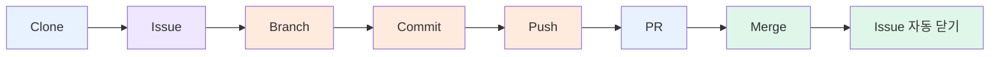

# 01-07. Part 1 체크리스트

협업 사이클을 처음부터 끝까지 한 번 굴려봤어요. 여러분의 GitHub 계정에 다음 결과물이 남았는지 확인해봅시다.

---

## ✅ 최종 체크리스트

### 사이클 7단계 완주

- [ ] 1. **Clone** — GitHub 레포를 내 컴퓨터로 가져왔음
- [ ] 2. **Issue** — Issue를 2개 만들었음
- [ ] 3. **Branch** — Issue 당 1개씩 브랜치를 만들었음 (`feat/#1-...`, `docs/#2-...`)
- [ ] 4. **Commit** — 컨벤션 (`<type>: <요약>`) 맞춘 커밋 3개 이상
- [ ] 5. **Push** — 두 브랜치 모두 원격에 push
- [ ] 6. **PR** — PR 2건 생성, 본문에 `Closes #이슈번호`
- [ ] 7. **Merge** — 두 PR 모두 Squash and merge

### GitHub 계정에 남은 결과물

- [ ] 실습 레포 1개 (Public)
- [ ] **머지된 PR 2건** — `Pull requests` 탭의 `Closed` 필터에서 확인
- [ ] **닫힌 Issue 2건** — `Issues` 탭의 `Closed` 필터에서 확인
- [ ] **컨벤션 맞춘 커밋 3건 이상** — `Code` 탭 → 우측 시계 모양 (History) → 또는 `git log --oneline` 로 확인

### 협업 습관

- [ ] PR Files changed 탭에서 셀프 리뷰 댓글 1개 이상 작성
- [ ] 머지된 후 GitHub과 로컬 모두에서 브랜치 정리

---

## 🎉 다 됐다면

여러분은 협업의 한 사이클을 손에 익혔어요. 이제 진짜 팀에 합류해서 같은 사이클을 **다른 사람의 PR과 부딪쳐가며** 굴려볼 차례입니다.

[**Part 2. 팀과 같이 쓰기 →**](../02-팀과-같이-쓰기/01-팀-레포-셋업.md)

---

## 한 사이클 다이어그램 복습

이 7단계가 부트캠프 4주 동안 매일 반복됩니다. 단지 다음번부터는 **팀원의 코드와 부딪치고** 리뷰가 오갈 뿐이에요.

---

### 💡 한 줄 요약

체크리스트 모두 ✅ 면 Part 2로. 결과물은 GitHub 잔디에 그대로 찍혀 있을 거예요. 이게 이력서 자산의 시작입니다.
