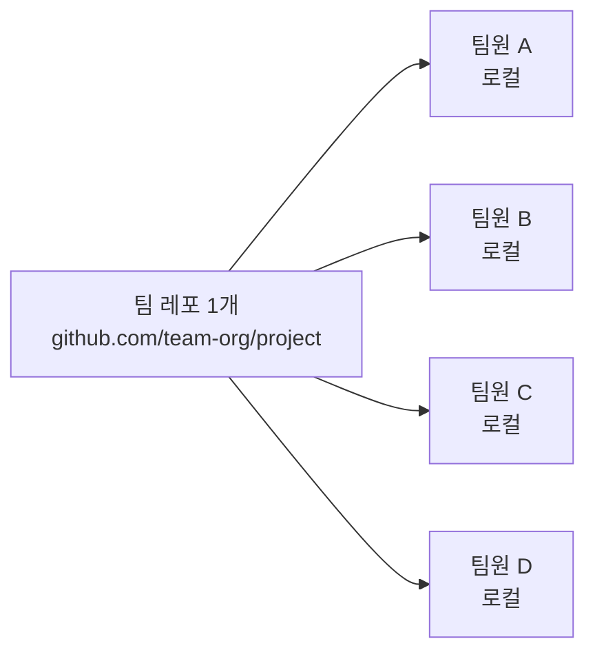

# 02-01. 팀 레포 셋업

📎 세션 슬라이드 06, 10 (GitHub · Clone)

Part 1 까지가 혼자 한 사이클을 굴리는 연습이었다면, Part 2 부터는 진짜 팀 협업. 가장 먼저 **팀이 공유할 레포 한 군데** 를 만들어야 합니다.



이 한 군데가 진실의 원천(single source of truth). 모든 팀원이 여기에서 clone하고, 여기로 push해요.

---

## 1. 두 가지 셋업 방식

부트캠프 환경에서는 보통 둘 중 하나로 갑니다.

| 방식 | 권한 모델 | 부트캠프에서 |
| --- | --- | --- |
| **A. 개인 계정 + Collaborators** | 한 명이 레포 주인, 나머지 초대 | ⭐⭐ 가볍게 시작할 때 |
| **B. Organization 만들고 팀 레포** | 조직이 주인, 멤버 관리 | ⭐⭐⭐ 부트캠프 권장. 이력서·포트폴리오에 좋음 |

> 💡 **이 단계는 보통 멘토가 미리 셋업해줍니다.** 멘티가 직접 만들 일이 없을 수도 있어요. 이 챕터는 "팀에 초대받았을 때 어떻게 들어가나" 와 "직접 만들 때 어떻게 하나" 둘 다 안내합니다.

---

## 2. 방식 A. 개인 계정 + Collaborators (가벼운 셋업)

팀장 한 명이 레포를 만들고 나머지를 Collaborator로 초대.

### 팀장이 할 일

1. [github.com/new](https://github.com/new) 에서 새 레포 생성 (01-01과 동일하게 README/.gitignore/license 포함)
2. 레포 페이지 → **Settings** → **Collaborators** → **Add people**
3. 팀원의 GitHub username 또는 이메일로 검색 → 초대
4. 권한은 **Write** 권장 (PR 머지 가능, 보호 룰 변경 불가)

### 팀원이 할 일

1. **GitHub 알림 메일** 의 초대 링크 클릭 (또는 [github.com/notifications](https://github.com/notifications))
2. **Accept invitation** 클릭
3. 레포에 접근 가능. clone:
   ```bash
   $ cd ~/work
   $ git clone https://github.com/팀장-username/team-project.git
   ```

---

## 3. 방식 B. Organization (부트캠프 권장)

조직 단위로 관리. 멤버 가입/탈퇴가 깔끔하고, 레포가 여러 개여도 한 군데서 관리.

### Organization 만들기

[github.com/organizations/new](https://github.com/organizations/new) → **Free** 플랜 선택 (오픈소스·교육용은 무료로 충분).

| 입력 | 권장 |
| --- | --- |
| **Organization account name** | `tnt-fe-team-3` 같이 (부트캠프-팀-번호) 식별 가능한 이름 |
| **Contact email** | 팀장 이메일 |
| **This organization belongs to** | `My personal account` |

생성 후 **Settings → Member privileges** 에서 기본 권한 조정 가능.

### 멤버 초대

Organization 페이지 → **People** → **Invite member**

- 팀원 username/이메일 입력
- Role: 기본 **Member** (관리는 팀장만 Owner)

### Team Repository 만들기

Organization 홈에서 **New** → 레포 생성. 소유자가 본인 계정이 아닌 **Organization** 으로 표시되도록.

---

## 4. 멘티가 받는 진짜 시나리오 — 멘토가 미리 셋업해줬다면

부트캠프에서 가장 흔한 모습이에요. 초대 메일을 받으면:

1. 메일에서 **View invitation** → GitHub 페이지 → **Accept invitation**
2. 레포 URL을 받아 clone:
   ```bash
   $ git clone https://github.com/bootcamp-2026/team-3-fe.git
   $ cd team-3-fe
   $ code .
   ```
3. 다음 챕터(02-02 보호 룰)로 이동해서 현재 보호 룰이 어떻게 걸려 있는지 확인

> 💡 **첫 clone 후 본인이 push 권한이 있는지 가벼운 테스트:** 새 브랜치 만들어서 push 한 번 해보세요. 401/403 에러가 나면 collaborator로 추가가 안 됐거나 인증 문제. 팀장/멘토에게 알리세요.

---

## 5. 첫 clone 후 점검할 것들

새 팀 레포를 clone한 직후 한 번씩 클릭해보면 좋은 곳들.

### Code 탭

- `README.md` — 프로젝트 소개를 잘 적어뒀나
- `.gitignore` — `.env`, `node_modules` 같은 게 있나
- `CONTRIBUTING.md` — 팀 컨벤션 (다음 챕터에서 만듭니다)
- `.github/PULL_REQUEST_TEMPLATE.md` — PR 본문 자동 채우기 템플릿 (다음 챕터에서)

### Issues / Pull requests / Projects 탭

- 이미 만들어진 이슈가 있는지
- 진행 중인 PR이 있는지

### Settings 탭 (권한이 있다면)

- **Branches** → 보호 룰이 걸려 있나 (02-02에서 직접 설정)
- **Collaborators** → 팀원 모두 들어왔나
- **Pull Requests** → "Automatically delete head branches" 켜져 있나

---

## 6. (참고) Fork 와의 차이

| 방식 | 언제 |
| --- | --- |
| **Collaborator로 초대받기** ⭐ | 같은 팀이라 같은 레포에 직접 push 권한이 있을 때 (부트캠프 표준) |
| **Fork** | 권한이 없는 외부인이 오픈소스에 기여할 때. 자기 계정으로 복사한 레포에 작업 후 원본으로 PR |

부트캠프 4주 동안은 **Collaborator** 가 정답입니다. Fork는 이 자료에서 안 다뤄요.

---

## 🩺 막힐 때

<details>
<summary><b>초대 메일이 안 와요</b></summary>

스팸함 확인 → 없으면 GitHub 알림 페이지 직접 확인: <a href="https://github.com/notifications">github.com/notifications</a>. 거기에도 없으면 팀장에게 username 다시 확인 (대소문자 정확히).

</details>

<details>
<summary><b>Clone은 됐는데 push가 403 에러</b></summary>

- Collaborator 권한이 <b>Read</b> 인 경우 push 불가 → 팀장에게 <b>Write</b> 권한 요청
- 또는 인증 문제 → <a href="../00-환경세팅/04-인증.md">04 인증</a> 의 막힐 때 박스

</details>

<details>
<summary><b>Organization 만들 때 Free 플랜이 안 보여요</b></summary>

GitHub 정책상 학생/오픈소스용 무료 플랜이 화면 하단에 작게 표시될 때가 있어요. 스크롤 더 내려보세요. 혹은 GitHub Education 인증 후 더 좋은 무료 옵션 가능.

</details>

<details>
<summary><b>레포에 push 안 했는데도 main이 자꾸 갱신돼요</b></summary>

다른 팀원이 push한 거예요. 작업 시작 전에 항상:

```bash
$ git switch main
$ git pull
$ git switch -c feat/#내-이슈
```

</details>

---

## ✅ 체크포인트

- [ ] 팀 레포의 collaborator로 들어가 있음 (또는 Organization 멤버)
- [ ] 팀 레포를 내 컴퓨터에 clone 완료
- [ ] `git remote -v` 가 팀 레포 URL을 가리킴
- [ ] 새 브랜치 push 가 정상 동작하는지 가벼운 테스트

[**다음: 02 보호 룰 3개 →**](./02-보호-룰-3개.md)

---

### 💡 한 줄 요약

부트캠프 팀 레포는 보통 멘토가 셋업. 멘티는 초대 받고 → Accept → clone → push 권한 확인까지 끝내면 준비 완료.

### 📚 더 깊이 보기

- GitHub 공식 — [Inviting collaborators to a personal repository](https://docs.github.com/en/account-and-profile/setting-up-and-managing-your-personal-account-on-github/managing-access-to-your-personal-repositories/inviting-collaborators-to-a-personal-repository)
- GitHub 공식 — [Creating a new organization from scratch](https://docs.github.com/en/organizations/collaborating-with-groups-in-organizations/creating-a-new-organization-from-scratch)
- 위키독스 — *6.6 조직(Organization)*
- Pro Git — *§6.4 Organization 관리하기*
