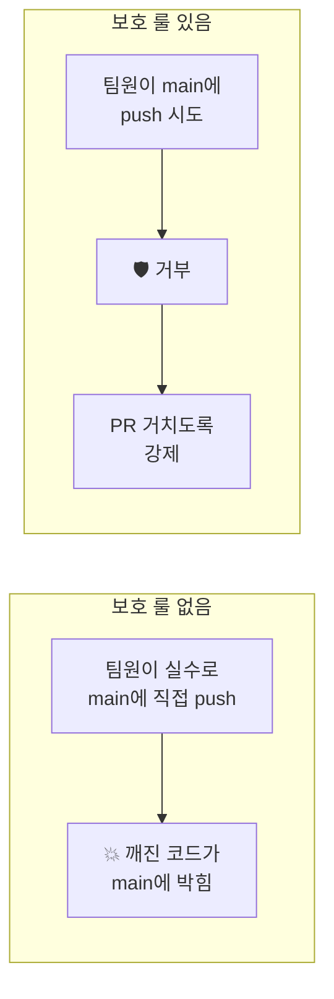

# 02-02. 보호 룰 3개

📎 세션 슬라이드 26 (브랜치 보호 룰)

세션 마지막에 멘토가 강조했던 그 룰들. **"브랜치 보호 룰을 세팅해서 main에 직접 코드를 푸시하지 못하게 막고, 리뷰를 강제하는 것이 가장 중요"** — 이 챕터의 목표가 그거예요.

> 💡 GitHub은 보호 룰 옵션이 10개 넘게 있어요. **부트캠프 4주에는 딱 3개만 켜면 충분합니다.** 옵션 전수를 외울 필요 없어요.

---

## 1. 왜 보호 룰을 거나요



세 가지 사고를 막아줍니다.

- ❌ main에 직접 push (PR 우회) → ✅ 룰 1
- ❌ 리뷰 없이 본인이 PR 머지 → ✅ 룰 2
- ❌ 리뷰 댓글 무시하고 머지 → ✅ 룰 3

---

## 2. 룰 켜기 — 5분이면 끝

> 권한: Organization Owner 또는 레포 Admin 만 가능. 멘토/팀장이 보통 설정합니다. 멘티는 어떤 룰이 걸려 있는지 확인만 해도 OK.

### 들어가는 길

레포 페이지 → **Settings** → 좌측 **Branches** → **Add branch protection rule** (또는 GitHub 최신 UI에서는 **Add classic branch protection rule**).

### Branch name pattern

```
main
```

(주의: `master` 가 아니라 `main`. 본인 레포의 기본 브랜치 이름과 일치)

---

## 3. 룰 1 — `main` 에 직접 push 금지

**같은 화면 안의 옵션:**

| 옵션 | 켜기 |
| --- | --- |
| ✅ **Require a pull request before merging** | 체크 |

이 한 줄로 **main에 직접 push는 불가능, PR을 통해서만 머지 가능** 상태가 됩니다.

세부 옵션:

- ✅ **Require approvals** → 다음 룰 2에서
- ✅ **Dismiss stale pull request approvals when new commits are pushed** — 권장. 새 커밋 올라오면 이전 approve가 무효화

---

## 4. 룰 2 — PR 리뷰 1명 이상 필수

위에서 켠 **Require approvals** 의 숫자 설정:

| 옵션 | 권장값 |
| --- | --- |
| **Required number of approvals before merging** | **1** (부트캠프 4~5명 팀 기준) |

> 💡 **2명 이상으로 올리면?** 안전하지만 머지가 자주 막혀요. 부트캠프 진척을 우선시한다면 1명이 현실적. 팀 사이즈가 커지면 2로 올리는 식.

---

## 5. 룰 3 — Conversations resolved

리뷰 댓글에 답변 없이 머지되는 걸 막아요.

| 옵션 | 켜기 |
| --- | --- |
| ✅ **Require conversation resolution before merging** | 체크 |

이렇게 하면 PR의 모든 댓글이 **Resolve conversation** 으로 닫혀야만 머지 버튼이 활성화됩니다. 무시하고 넘기지 않게 강제.

---

## 6. (선택) 한 가지 더 — Force push 차단

`git push --force` 가 main에 들어와서 팀원 작업을 날려버리는 사고를 막아요.

| 옵션 | 켜기 |
| --- | --- |
| ✅ **Do not allow bypassing the above settings** | 체크 — Admin도 룰 적용 받음 |
| ❌ **Allow force pushes** | 체크 안 함 (기본값) |
| ❌ **Allow deletions** | 체크 안 함 (기본값) |

부트캠프 4주에 force push 가 필요한 상황은 거의 없습니다.

---

## 7. 화면 한 번 더 정리

설정이 끝나면 화면 하단 **Create** (또는 **Save changes**) 클릭.

이렇게 켜진 보호 룰 상태:

| 상태 | OK? |
| --- | --- |
| main에 직접 push 시도 | ❌ 거부 — `(protected branch hook declined)` 에러 |
| PR을 만들었는데 리뷰 안 받음 | ❌ 머지 버튼 회색 |
| 리뷰는 받았는데 댓글이 unresolved | ❌ 머지 버튼 회색 |
| PR + 리뷰 1명 Approve + 모든 댓글 Resolve | ✅ 머지 가능 |

---

## 8. 멘티가 확인하는 법

본인이 룰을 켠 게 아니더라도, 팀 레포 상태를 한 번 확인해보세요.

```bash
# 일부러 main에 직접 push 시도 (실패해야 정상)
$ git switch main
$ echo "test" >> README.md
$ git add README.md
$ git commit -m "test: protection check"
$ git push
remote: error: GH006: Protected branch update failed for refs/heads/main.
remote: error: At least 1 approving review is required by reviewers with write access.
To https://github.com/.../...
 ! [remote rejected] main -> main (protected branch hook declined)

# 로컬 커밋 되돌리기
$ git reset --soft HEAD~1
$ git restore --staged README.md
$ git restore README.md
```

이렇게 거부되면 보호 룰이 잘 걸려 있는 상태입니다. 🎉

---

## 9. 자동 머지 정리 옵션 (보너스)

룰은 아니지만 같이 켜두면 좋은 두 가지.

### Automatically delete head branches

머지된 가지를 자동으로 지워줘요. **Settings** → **General** → **Pull Requests** → 체크.

### Merge 전략 제한 — Squash만

부트캠프는 Squash 통일이니, 다른 옵션을 아예 못 고르게 막을 수 있어요.

**Settings** → **General** → **Pull Requests**:
- ✅ **Allow squash merging**
- ❌ **Allow merge commits**
- ❌ **Allow rebase merging**

---

## 🩺 막힐 때

<details>
<summary><b>"Add branch protection rule" 버튼이 안 보여요</b></summary>

레포 Admin 권한이 필요합니다. 팀장/멘토에게 권한 요청 또는 셋업 요청.

</details>

<details>
<summary><b>룰 켰는데 본인은 우회해서 push가 되네요</b></summary>

<b>Do not allow bypassing the above settings</b> 가 체크 안 돼 있어요. Admin도 룰 적용 받게 다시 설정.

</details>

<details>
<summary><b>PR을 머지하려는데 리뷰가 필요하다고 떠요. 본인 PR을 본인이 Approve해도 되나요?</b></summary>

GitHub은 자기 자신의 PR을 본인이 Approve할 수 없어요. 팀원 중 한 명에게 리뷰 요청. 정말 급하면 보호 룰의 Required approvals 를 임시로 0으로 낮추거나, Admin 권한자가 머지.

</details>

<details>
<summary><b>실수로 main에 직접 push했어요 (룰 켜기 전)</b></summary>

이미 들어간 커밋은 어쩔 수 없어요. 이제부터라도 룰을 켜서 같은 사고를 막읍시다.

</details>

---

## 🧪 점검 퀴즈

**Q1.** 부트캠프 4주 팀이 main 에 켜야 할 **최소 3가지** 보호 룰은?

- (A) Require signed commits / Require linear history / Require deployments
- (B) Require PR before merging / Require approvals (≥1) / Require conversation resolution
- (C) Block force pushes / Block deletions / Block direct pushes
- (D) Allow squash / Allow merge / Allow rebase

<details><summary>정답</summary>

**(B)**. 본문 룰 1·2·3. (C) 의 force push·deletion 차단은 보너스로 같이 켜두면 좋지만 필수 3개는 아닙니다. (D) 는 머지 방식 옵션(Settings → General)이라 보호 룰 아님.

</details>

**Q2.** 본인 PR 을 본인이 Approve 할 수 있나요?

- (A) 가능. self-approve 라 함
- (B) GitHub 이 자동으로 막음
- (C) 보호 룰을 끄면 가능
- (D) 팀장만 가능

<details><summary>정답</summary>

**(B)**. GitHub 의 정책. 부트캠프 4~5명 팀이라 본인 PR 은 다른 팀원에게 리뷰 요청해야 머지 가능.

</details>

**Q3.** main 에 직접 push 하려 했더니 `GH006: Protected branch update failed` 가 떴어요. 이건 무엇을 의미하나요?

- (A) Git 이 깨졌으니 재설치 필요
- (B) 보호 룰이 정상 동작 중. PR 동선으로 가야 함
- (C) 네트워크 문제
- (D) 인증 토큰 만료

<details><summary>정답</summary>

**(B)**. 보호 룰이 잘 걸려 있다는 증거. 새 브랜치로 옮겨 PR 동선으로 가세요. 자세한 처방은 [03-05 #16](../03-자주-막히는-순간/05-에러-메시지-사전.md#16-gh006-protected-branch-update-failed).

</details>

**Q4.** "Do not allow bypassing the above settings" 옵션을 켜면?

- (A) 모든 푸시가 막힘
- (B) Admin 도 보호 룰 적용 받음
- (C) 보호 룰이 비활성화됨
- (D) PR 생성이 불가능해짐

<details><summary>정답</summary>

**(B)**. Admin 까지 룰 적용 → "본인이 만든 룰을 본인이 우회하는" 사고 방지. 부트캠프에서는 켜두는 게 안전.

</details>

---

## ✅ 체크포인트 (팀장/Admin용)

- [ ] **Branch name pattern** = `main`
- [ ] ✅ Require a pull request before merging
- [ ] ✅ Require approvals — 최소 **1**
- [ ] ✅ Dismiss stale pull request approvals when new commits are pushed
- [ ] ✅ Require conversation resolution before merging
- [ ] ✅ Do not allow bypassing the above settings
- [ ] (선택) Settings → General → Allow squash merging만 ON

## ✅ 체크포인트 (멘티용)

- [ ] main 직접 push 시도 시 거부되는 것 확인
- [ ] PR 페이지 머지 버튼이 리뷰 없이는 회색인 것 확인
- [ ] 위 점검 퀴즈 4문항 모두 정답 확인

[**다음: 03 컨벤션 합의 템플릿 →**](./03-컨벤션-합의-템플릿.md)

---

### 💡 한 줄 요약

**main 직접 push 금지 + 리뷰 1명 + Conversations resolved** 3개. 옵션 전수 외울 필요 X. Squash만 허용 + 자동 브랜치 삭제는 보너스.

### 📚 더 깊이 보기

- GitHub 공식 — [About protected branches](https://docs.github.com/en/repositories/configuring-branches-and-merges-in-your-repository/managing-protected-branches/about-protected-branches)
- GitHub 공식 — [Managing a branch protection rule](https://docs.github.com/en/repositories/configuring-branches-and-merges-in-your-repository/managing-protected-branches/managing-a-branch-protection-rule)
- 위키독스 — *6.5 브랜치 보호*
- Pro Git — *§3.4 브랜치 워크플로*
