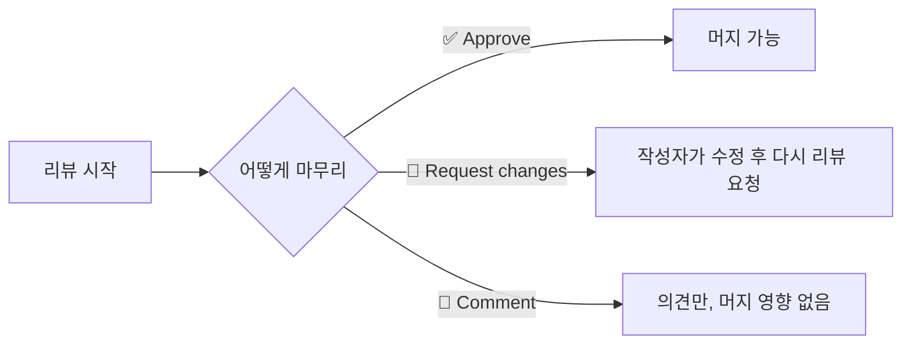
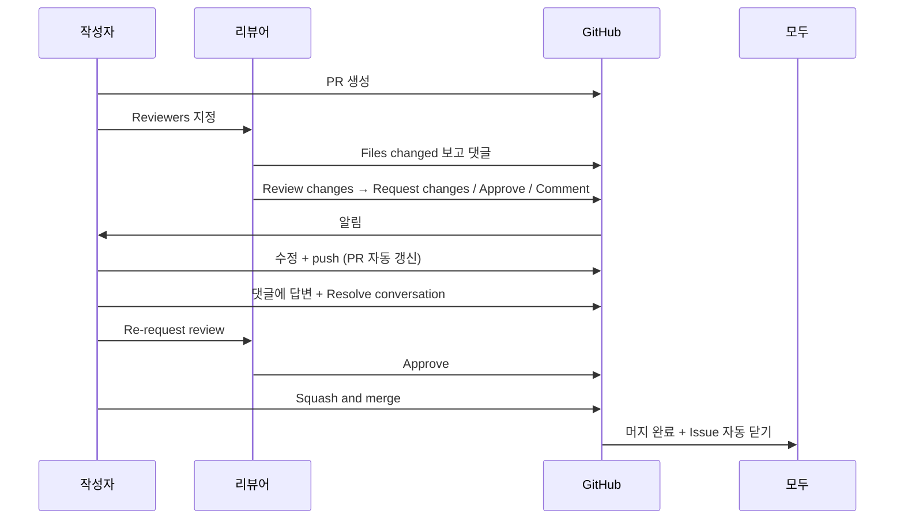

# 02-04. PR 리뷰 에티켓

📎 세션 슬라이드 17 (PR)

코드를 짜는 시간만큼 코드를 읽는 시간이 길어집니다. 팀에서 리뷰 문화가 잘 자리잡으면 4주 동안의 결과물 품질이 눈에 띄게 좋아져요. 반대면 PR이 쌓이고 멤버끼리 어색해집니다.

---

## 1. 리뷰의 4가지 도구

PR Files changed 탭에서 쓸 수 있는 도구들.

| 도구 | 언제 |
| --- | --- |
| 💬 **Comment** | 단순 의견·질문. 머지에 영향 없음 |
| ✏️ **Suggestion** | "이렇게 바꿔보면 어때요" — 한 클릭으로 적용 가능 |
| ✅ **Approve** | 머지해도 좋아요 |
| 🛑 **Request changes** | 수정 필요. 머지 막힘 |

### Approve / Request changes / Comment 차이

PR 페이지의 **Review changes** 버튼을 눌렀을 때 셋 중 하나를 고릅니다.



**언제 무엇을:**

- **Approve** — 변경에 동의, 머지 OK
- **Request changes** — 머지 전 반드시 고쳐야 할 부분이 있을 때 (보안 이슈, 명백한 버그)
- **Comment** — 토론을 시작하고 싶지만 머지 자체는 막고 싶지 않을 때 (스타일 의견, 후속 개선 제안)

> 💡 부트캠프 팀에서는 **Request changes 를 아껴 쓰세요.** 상대가 압박감을 느끼고 PR을 두려워하게 돼요. 사소한 건 Comment + Approve 조합으로.

---

## 2. Suggestion 블록 — 가장 유용한 도구

상대가 한 번 클릭으로 변경을 받아들일 수 있는 코드 제안. 부트캠프 4주 동안 가장 많이 쓰게 될 거예요.

### 동선

1. PR Files changed 탭에서 코드의 한 줄(또는 여러 줄) 선택
2. 좌측 파란 `+` → 댓글 입력칸
3. 입력칸 상단의 ± 아이콘 클릭 → 코드 블록이 ```` ```suggestion ```` 으로 자동 생성
4. 안에 제안하는 새 코드를 적어 제출
5. 작성자는 **Commit suggestion** 클릭 한 번으로 적용

### 마크다운 예시

````markdown
이 변수명이 더 명확할 것 같아요.

```suggestion
const isLoggedIn = userToken !== null;
```
````

### 실제 보이는 모습

리뷰어가 위처럼 적으면 PR 작성자 화면에서는 코드 블록 위에 **Add suggestion to batch** / **Commit suggestion** 버튼이 떠요. 클릭하면 그 줄이 그대로 교체.

> 💡 작은 오타 / 변수명 / 들여쓰기 같은 건 텍스트로 길게 설명하지 말고 Suggestion 으로 보내세요. 작성자가 1초에 적용 가능.

---

## 3. 좋은 리뷰 댓글 vs 나쁜 리뷰 댓글

### 좋은 예 ✅

> 💡 이 `useState` 의 초기값이 `null` 이면 첫 렌더링에 빈 값이 노출될 수 있어요. 빈 문자열 또는 로딩 상태 처리 어떨까요?

- 이유 설명 (왜)
- 대안 제시
- 톤 부드럽게

> ```suggestion
> if (response.status !== 200) throw new Error('Network error');
> ```
> 에러 던지는 게 명시적이라 디버깅이 편할 것 같아요.

- 한 번 클릭으로 적용 가능
- 한 줄 이유

> 👍 이 부분 깔끔하게 분리됐네요. 다음에 비슷한 케이스 생기면 패턴 따라가면 좋겠어요.

- 잘된 부분도 칭찬
- 팀 학습 효과

### 나쁜 예 ❌

> 왜 이렇게 짰어요?

- 공격적, 대안 없음

> 이건 틀렸어요. 다시 짜야 합니다.

- 무엇이 왜 틀렸는지 안 알려줌

> nit: this should be camelCase
> nit: missing semicolon
> nit: prefer arrow function
> (15개 nit 댓글 도배)

- 압박감 유발 (한꺼번에 묶어서 한 댓글로 처리)

> (리뷰 안 함, 그냥 Approve)

- 머지 통과시키기 위한 형식적 리뷰. 작성자에게 도움 안 됨

---

## 4. nit, blocking, optional — 의도 라벨

리뷰 댓글에 의도를 한 단어로 표시해주면 작성자가 우선순위를 판단하기 쉬워져요.

| 라벨 | 의미 |
| --- | --- |
| `nit:` (nitpick) | 사소한 의견. 굳이 안 고쳐도 됨 |
| `optional:` | 선택사항. 더 좋다고 생각하지만 강제 X |
| `important:` 또는 `blocking:` | 머지 전 반드시 고쳐야 함 |
| `question:` | 질문. 답변만 받으면 OK |
| `praise:` 또는 👍 | 칭찬 |

예:

> nit: 변수명을 `users` 보다 `userList` 가 더 명확할 것 같아요.
>
> blocking: 이 부분 SQL injection 위험이 있어요. prepared statement 로 바꿔주세요.

---

## 5. 리뷰 받는 사람의 매너

리뷰는 양방향. 받는 사람도 룰이 있어요.

### Do

- 댓글 하나하나에 답변 (이모지 ✅, "수정했어요", "다음 PR에서 처리할게요" 등)
- 수정 후 **Re-request review** (리뷰어 옆 동그라미 버튼)
- 의견이 다르면 정중히 반대 의견 제시 + 토론

### Don't

- 댓글 무시하고 머지
- "리뷰 너무 빡세다" 같은 감정적 반응
- 본인이 동의 안 한 변경을 말없이 강행

### Resolve conversation

수정 완료 / 토론 끝난 댓글은 **Resolve conversation** 버튼으로 닫아요. 02-02 보호 룰을 켰다면 **모든 댓글이 Resolve돼야 머지 가능**.

---

## 6. PR 리뷰 흐름 — 한 번에 보기



---

## 7. 실습 — 팀원 PR에 리뷰 1번 달기

팀원 중 누군가 첫 PR을 올렸을 거예요 (보통 02-03 컨벤션 합의의 `CONTRIBUTING.md` PR). 그 PR에:

1. Files changed 탭
2. 한 줄 선택 → **Comment** 또는 **Suggestion** 작성
3. **Review changes** → **Approve**

본인 PR이 아닌 한, 처음 다는 리뷰는 어색해도 짧게 시도. 칭찬 한 줄도 OK.

---

## 8. (참고) VSCode 에서 리뷰하기

GitHub Pull Requests 확장 (00-05에서 안내) 을 깔았다면 VSCode 안에서 PR 리뷰가 가능해요.

- 좌측 사이드바 PR 아이콘
- 보고 싶은 PR 클릭 → Files 탭
- 코드 우클릭 → **Add Comment**
- 똑같이 Suggestion, Approve 가능

긴 리뷰는 VSCode가 편하고, 짧은 리뷰는 웹이 빠릅니다.

---

## 🩺 막힐 때

<details>
<summary><b>Request changes 했는데 마음이 바뀌었어요</b></summary>

PR 페이지 본인 리뷰 옆 <b>...</b> → <b>Dismiss review</b>. 그다음 다시 Approve.

</details>

<details>
<summary><b>리뷰어가 응답이 없어요</b></summary>

PR 우측 사이드바에서 <b>Re-request review</b> (동그라미 화살표 버튼) 클릭하면 알림이 다시 갑니다. 그래도 안 되면 팀 Slack 채널에 멘션.

</details>

<details>
<summary><b>Conversations resolved 가 안 닫혀요</b></summary>

각 댓글 우상단 <b>Resolve conversation</b> 버튼은 그 댓글 스레드의 누구든 (보통 작성자) 닫을 수 있어요. 버튼이 안 보이면 해당 댓글이 outdated (코드가 바뀌어서 무관해진 상태) 일 가능성, 새로 리뷰 요청.

</details>

<details>
<summary><b>Suggestion 을 적용했더니 다른 커밋이 함께 만들어졌어요</b></summary>

GitHub이 자동으로 "Apply suggestion from ..." 커밋을 만들어요. 머지할 때 Squash가 정리해주니 신경 안 써도 됩니다.

</details>

---

## ✅ 체크포인트

- [ ] 팀원 PR에 리뷰 1번 이상 작성
- [ ] Suggestion 블록 사용해본 적 있음
- [ ] 본인 PR에 달린 댓글에 답변 + Resolve
- [ ] 의도 라벨 (`nit:`, `blocking:` 등) 한 번 써봄

[**다음: 05 Conflict 해결 →**](./05-conflict-해결.md)

---

### 💡 한 줄 요약

Suggestion 블록 적극 사용 + 의도 라벨 (`nit:`, `blocking:`) 로 우선순위 표시. Request changes 는 아껴 쓰고, 좋은 점도 칭찬.

### 📚 더 깊이 보기

- GitHub 공식 — [Reviewing proposed changes in a pull request](https://docs.github.com/en/pull-requests/collaborating-with-pull-requests/reviewing-changes-in-pull-requests/reviewing-proposed-changes-in-a-pull-request)
- GitHub 공식 — [Incorporating feedback in your pull request](https://docs.github.com/en/pull-requests/collaborating-with-pull-requests/reviewing-changes-in-pull-requests/incorporating-feedback-in-your-pull-request)
- GitHub 공식 — [Commenting on a pull request](https://docs.github.com/en/pull-requests/collaborating-with-pull-requests/reviewing-changes-in-pull-requests/commenting-on-a-pull-request)
- Google Engineering Practices — [Code Review Developer Guide](https://google.github.io/eng-practices/review/) (영문, 코드 리뷰 베스트 프랙티스)
- 위키독스 — *6.1.2 PR(Pull Request)을 받았을 때 테스트하고 병합하기*
