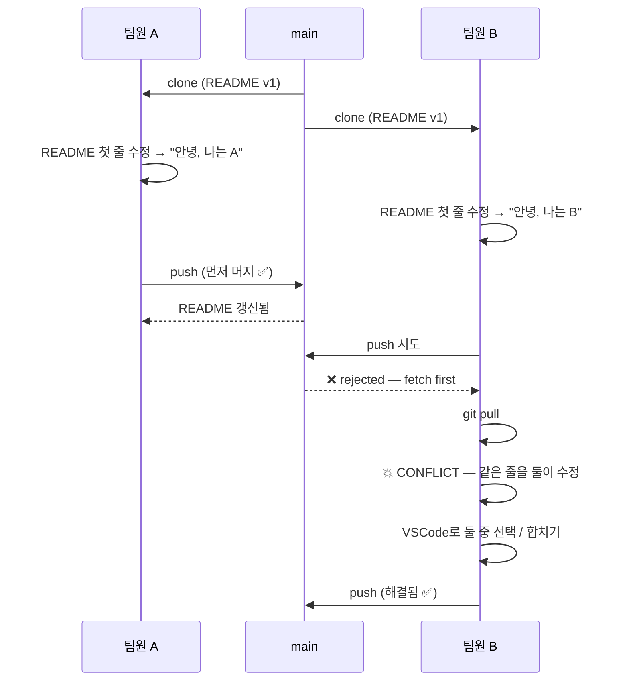

# 02-05. Conflict 해결

📎 세션 슬라이드 23 (RISK 1 — Conflict)

세션의 RISK 1번. **두 사람이 같은 파일, 같은 줄을 수정했을 때 Git이 누구 코드가 맞는지 모를 때** 일어나는 현상이에요.

이 챕터에서는 충돌을 **일부러 만들어보고**, VSCode로 해결하는 표준 동선을 손에 익힙니다. 한 번 직접 해보면 다음에 만났을 때 패닉하지 않아요.

---

## 1. 충돌이 일어나는 시나리오



해결 자체는 단순합니다: **"둘 중 어느 게 맞는지 사람이 정한다."** Git은 그 사람의 선택을 받아 새 커밋으로 기록할 뿐.

---

## 2. 실습 — 충돌을 일부러 만들어보기

혼자서 가짜 충돌을 만드는 가장 빠른 방법: **두 폴더로 같은 레포를 clone** 해서 양쪽에서 같은 줄 수정.

### 단계 1. 두 폴더로 같은 레포 clone

```bash
$ cd ~/work
$ git clone https://github.com/내-username/git-practice-2026.git clone-A
$ git clone https://github.com/내-username/git-practice-2026.git clone-B
```

이렇게 같은 GitHub 레포를 두 폴더 (`clone-A`, `clone-B`) 에 복사. **각각 다른 팀원의 컴퓨터인 척** 시뮬레이션할 수 있어요.

### 단계 2. clone-A 에서 작업 + push

```bash
$ cd ~/work/clone-A
$ git switch -c conflict/#test-a
```

`README.md` 의 첫 번째 줄을 수정:

```markdown
# git-practice-2026 — Awesome project from A
```

저장 후:

```bash
$ git add README.md
$ git commit -m "docs: README 제목에 부제 추가 (A안)"
$ git push -u origin conflict/#test-a
```

GitHub에 PR 만들고 머지. (Squash and merge) main이 갱신됐어요.

### 단계 3. clone-B 에서 같은 줄 수정

```bash
$ cd ~/work/clone-B
$ git switch -c conflict/#test-b
```

`README.md` 의 같은 첫 번째 줄을 다르게 수정:

```markdown
# git-practice-2026 — Made with love by B
```

저장 후:

```bash
$ git add README.md
$ git commit -m "docs: README 제목에 부제 추가 (B안)"
$ git push -u origin conflict/#test-b
```

GitHub에 PR을 만들면:

> 🛑 **This branch has conflicts that must be resolved**

충돌 발생.

---

## 3. 해결 — VSCode 마커 따라가기

### 단계 1. main의 최신을 가져와 merge

```bash
$ cd ~/work/clone-B
$ git pull origin main
Auto-merging README.md
CONFLICT (content): Merge conflict in README.md
Automatic merge failed; fix conflicts and then commit the result.
```

이 메시지가 나오면 정상. README.md 가 충돌 마커가 박힌 상태로 열려요.

### 단계 2. VSCode 에서 보기

```bash
$ code .
```

`README.md` 를 열면 첫 줄 근처에 이런 충돌 마커가 보입니다.

```
<<<<<<< HEAD
# git-practice-2026 — Made with love by B
=======
# git-practice-2026 — Awesome project from A
>>>>>>> a1b2c3d4 (docs: README 제목에 부제 추가 (A안))
```

VSCode는 이 마커를 인식해 **버튼으로** 띄워줘요. 줄 위쪽에 네 개의 옵션:

| 버튼 | 의미 |
| --- | --- |
| **Accept Current Change** | HEAD (지금 내 브랜치) 만 채택 |
| **Accept Incoming Change** | main 에서 들어온 변경만 채택 |
| **Accept Both Changes** | 둘 다 채택 (위아래로 나란히) |
| **Compare Changes** | diff 뷰로 좌우 비교 |

### 단계 3. 선택 — 또는 직접 합치기

이번 시나리오는 둘 다 의미 있는 정보 (A의 "Awesome project", B의 "love") 라고 가정하고 둘을 합쳐봅시다.

마커들을 직접 지우고 한 줄로 합쳐 적기:

```markdown
# git-practice-2026 — Awesome project, made with love by A & B
```

> 💡 **충돌 마커 (`<<<<<<<`, `=======`, `>>>>>>>`) 를 절대 그대로 두고 커밋하지 마세요.** Git이 거부하진 않지만, 동작이 깨진 코드가 main에 들어가요. 마커는 **반드시 모두 지워야** 합니다.

### 단계 4. 해결 표시 후 커밋

```bash
$ git add README.md
$ git status
On branch conflict/#test-b
All conflicts fixed but you are still merging.
  (use "git commit" to conclude merge)

$ git commit -m "fix: README 충돌 해결 — A·B 합치기"
[conflict/#test-b 5e6f7g8] fix: README 충돌 해결 — A·B 합치기

$ git push
```

GitHub PR 페이지를 새로고침. 노란 충돌 경고가 사라지고 **머지 가능** 상태가 됐어요.

---

## 4. 충돌 미리보기 — `git diff` 만 보고도 알 수 있다

PR을 만들기 전에 충돌이 있을지 미리 확인하고 싶다면:

```bash
$ git fetch origin
$ git diff origin/main
```

원격 main 과 내 현재 브랜치의 차이가 보입니다. 같은 줄이 양쪽에서 다르게 수정됐다면 push할 때 충돌이 날 가능성 큼.

---

## 5. 충돌을 줄이는 습관

해결보다 예방이 쉬워요. 부트캠프 4주에 도움 되는 습관 5가지.

1. **작업 시작 전 항상 `git pull`** — main 최신을 받고 브랜치 시작
2. **한 PR = 한 작업 단위** — 큰 PR일수록 충돌 가능성 커짐
3. **작업 중에도 가끔 main 동기화** — 1~2일 이상 걸리는 작업은 중간에 main 변경을 자기 브랜치에 가져오기:
   ```bash
   $ git switch feat/#1-my-work
   $ git fetch origin
   $ git merge origin/main
   # 또는: git pull origin main
   ```
4. **파일 분할** — 한 파일에 여러 명이 동시에 작업하지 않게 모듈 단위 분할
5. **소통** — "나 README 건드릴게요" 한 줄 Slack 으로 충돌 절반 줄어요

---

## 6. (참고) 충돌 시각화 — 도구

| 도구 | 언제 |
| --- | --- |
| **VSCode 내장** ⭐ | 부트캠프 권장. 버튼 클릭으로 빠름 |
| GitLens (VSCode 확장) | 충돌 + Blame 함께 보고 싶을 때 |
| GitHub 웹의 **Resolve conflicts** 버튼 | 간단한 충돌은 GitHub PR 페이지에서도 바로 해결 가능 |
| 터미널 + Vim | 권장 안 함 (충돌 해결에는 마커가 시각화되는 GUI가 압도적) |

### GitHub 웹에서 바로 해결하기

PR 페이지의 충돌 경고 옆 **Resolve conflicts** 버튼 → 웹 에디터가 열려요. 마커 직접 편집 → **Mark as resolved** → **Commit merge**. 간단한 충돌은 이쪽이 더 빠릅니다.

---

## 🩺 막힐 때

<details>
<summary><b>충돌 마커를 그대로 두고 커밋·푸시했어요</b></summary>

코드가 깨진 상태로 push된 거예요. 마커를 지우고 새 커밋 만들어 다시 push:

```bash
# 마커 삭제 후
$ git add 파일명
$ git commit -m "fix: leftover conflict markers"
$ git push
```

</details>

<details>
<summary><b>merge를 취소하고 싶어요</b></summary>

merge 도중 중단 (해결 안 한 상태로 원래대로 돌리기):

```bash
$ git merge --abort
```

merge 전 상태로 되돌아갑니다. <code>git status</code> 가 깔끔하면 성공.

</details>

<details>
<summary><b>VSCode에 "Accept ..." 버튼이 안 보여요</b></summary>

VSCode 버전이 너무 낮거나, 파일이 너무 큰 경우. 파일을 다시 열거나 VSCode 업데이트. 안 되면 직접 마커를 지우고 원하는 내용 남기시면 됩니다.

</details>

<details>
<summary><b>한 PR에 충돌이 5개 파일 이상 있어요</b></summary>

PR 자체가 너무 큰 신호예요. 해결은 가능하지만, 다음번엔 PR을 작게 쪼개세요. 작은 PR은 충돌도 작아요.

</details>

<details>
<summary><b>충돌은 해결했는데 머지 후 코드가 깨졌어요</b></summary>

해결 과정에서 한쪽 변경을 잘못 지웠을 가능성. 즉시:

1. 깨진 커밋을 <b>revert</b> 로 안전하게 되돌리기 (<a href="../03-자주-막히는-순간/02-안전한-되돌리기.md">02 안전한 되돌리기</a>)
2. 충돌 해결을 다시 시도

</details>

---

## 🧪 점검 퀴즈

**Q1.** 충돌이 발생하는 가장 정확한 조건은?

- (A) 두 사람이 같은 레포에서 작업
- (B) 두 사람이 다른 파일을 동시에 수정
- (C) 두 브랜치가 같은 파일의 같은 줄을 다르게 수정한 뒤 병합 시도
- (D) `git push` 가 거부됨

<details><summary>정답</summary>

**(C)**. 다른 파일 수정 또는 같은 파일이라도 다른 줄 수정은 Git 이 자동 병합. **같은 줄을 다르게** 수정했을 때만 사람의 결정이 필요한 충돌.

</details>

**Q2.** VSCode 에서 마커가 박힌 파일을 열었더니 `<<<<<<<`, `=======`, `>>>>>>>` 가 보입니다. 무엇을 절대 하면 안 되나요?

- (A) "Accept Both Changes" 버튼 클릭
- (B) 마커를 그대로 둔 채 add → commit
- (C) 한쪽을 골라 다른 쪽 지우기
- (D) 둘 다 지우고 새로 쓰기

<details><summary>정답</summary>

**(B)**. 마커가 박힌 코드는 동작이 깨진 코드예요. Git 이 거부하진 않지만 main 에 들어가면 빌드 실패. **마커는 모두 지워야** 합니다.

</details>

**Q3.** `git pull` 도중 충돌이 났는데 지금 해결할 시간이 없어요. 원래 상태로 되돌리려면?

- (A) `git reset --hard HEAD`
- (B) `git merge --abort`
- (C) `git push --force`
- (D) 폴더 삭제 후 다시 clone

<details><summary>정답</summary>

**(B)** `git merge --abort`. 안전하게 머지 전 상태로 복귀. (A) 는 변경 영구 손실 ⚠️, (C) 는 팀원 작업 날림 ⚠️, (D) 는 작업 손실. 같은 패턴으로 `git revert --abort`, `git rebase --abort` 도 안전한 탈출구. 자세한 건 [03-04 시나리오 7](../03-자주-막히는-순간/04-시나리오별-복구.md#-시나리오-7--merge--rebase--revert-도중에-그만하고-싶어요).

</details>

**Q4.** 충돌을 줄이는 가장 효과적인 습관은?

- (A) 큰 PR 한 방
- (B) 모든 작업을 main 에서 직접
- (C) 작업 시작 전 `git pull` + 작은 PR 단위 + "나 이 파일 건드릴게요" 한 줄 공유
- (D) `git push --force` 자주 쓰기

<details><summary>정답</summary>

**(C)**. 예방이 해결보다 항상 쉬워요. 특히 **소통 한 줄** 의 효과가 큽니다.

</details>

---

## ✅ 체크포인트

- [ ] 두 폴더 시나리오로 충돌을 일부러 한 번 발생시켜봄
- [ ] VSCode 의 Accept 버튼 4종 한 번씩 봄
- [ ] 마커를 직접 편집해서 합치는 방식도 해봄
- [ ] 해결 후 add → commit → push 까지 완주
- [ ] PR 머지 가능 상태로 전환된 것 확인
- [ ] 위 점검 퀴즈 4문항 모두 정답 확인

[**다음: 06 체크리스트 →**](./06-체크리스트.md)

---

### 💡 한 줄 요약

`git pull` → 충돌 → VSCode 마커 따라가서 **둘 중 선택 또는 직접 합치기** → 마커 모두 지우기 → add → commit → push. 마커를 절대 그대로 커밋하지 말 것.

### 📚 더 깊이 보기

- GitHub 공식 — [Resolving a merge conflict on GitHub](https://docs.github.com/en/pull-requests/collaborating-with-pull-requests/addressing-merge-conflicts/resolving-a-merge-conflict-on-github)
- GitHub 공식 — [Resolving a merge conflict using the command line](https://docs.github.com/en/pull-requests/collaborating-with-pull-requests/addressing-merge-conflicts/resolving-a-merge-conflict-using-the-command-line)
- VSCode 공식 — [Source Control — Merge conflicts](https://code.visualstudio.com/docs/sourcecontrol/overview#_merge-conflicts)
- 위키독스 — *3.2.3 충돌 해결 방법*, *4.2 커밋의 conflict 및 diverged*
- Pro Git — *§3.2 브랜치와 Merge의 기초* (Conflict 절)
