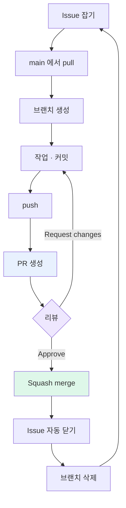

# 02-06. Part 2 체크리스트

팀에 합류해서 같이 굴리는 데 필요한 모든 셋업과 협업 흐름을 한 번씩 손에 익혀봤어요. 결과물 점검합니다.

---

## ✅ 최종 체크리스트

### 팀 레포 셋업

- [ ] 팀 레포의 collaborator (또는 Organization 멤버) 로 들어가 있음
- [ ] 팀 레포를 내 컴퓨터에 clone 완료
- [ ] 새 브랜치 push가 정상 동작

### 보호 룰 (팀장/Admin)

- [ ] main 보호 룰 활성:
  - [ ] Require a pull request before merging
  - [ ] Require approvals — 최소 1
  - [ ] Require conversation resolution before merging
  - [ ] Do not allow bypassing the above settings
- [ ] (선택) Settings → General → Allow squash merging만 ON
- [ ] (선택) Automatically delete head branches ON

### 보호 룰 확인 (멘티 전원)

- [ ] main 직접 push 시도가 거부되는 것 확인
- [ ] PR 페이지에서 리뷰 없이는 머지 버튼이 회색

### 컨벤션

- [ ] `CONTRIBUTING.md` 가 main에 머지됨 + 팀원 전원 정독
- [ ] `.github/PULL_REQUEST_TEMPLATE.md` 가 main에 머지됨
- [ ] 새 PR 만들 때 본문 양식이 자동으로 채워지는 것 확인

### 협업 1라운드 직접 굴려보기

- [ ] **팀원 다른 사람의 PR에 리뷰 1번 이상** 작성
- [ ] **본인 PR에 달린 리뷰 댓글에 답변** + Resolve
- [ ] **충돌을 직접 1번 해결** (의도적 또는 자연 발생)
- [ ] Suggestion 블록 사용해봄
- [ ] 의도 라벨 (`nit:`, `blocking:`) 한 번 써봄

---

## 🎉 다 됐다면

팀 협업의 기본 도구는 모두 손에 들어왔어요. 4주 동안 같은 흐름을 매일 반복하시면 됩니다.

남은 한 가지 — **막혔을 때 어디서 도움을 받나** 입니다. 다음 파트는 사전식 트러블슈팅이에요.

[**Part 3. 자주 막히는 순간 →**](../03-자주-막히는-순간/01-faq.md)

---

## 팀 협업 흐름 한눈에

이게 부트캠프 4주의 매일이 됩니다.

---

### 💡 한 줄 요약

체크리스트 모두 ✅ 면 팀 협업 준비 완료. 막힐 일은 분명히 옵니다 — Part 3을 사전처럼 곁에 두세요.
