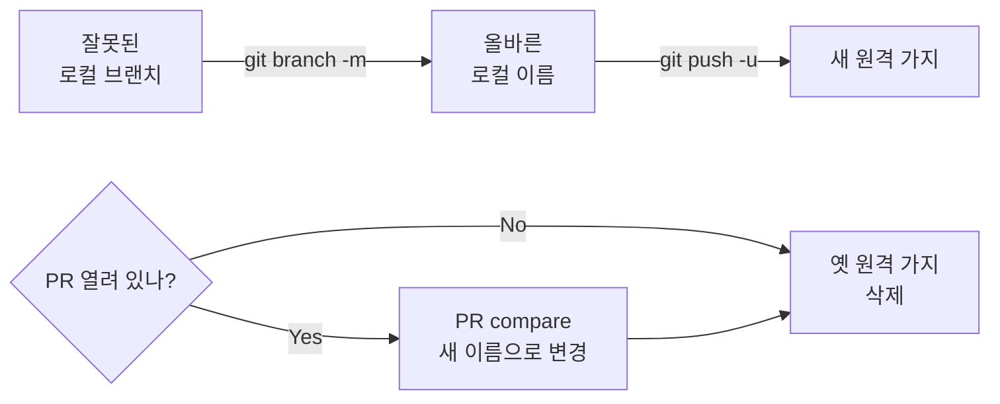

# 03-04. 시나리오별 복구 — "이런 상황엔 이렇게"

> 부트캠프 4주에 실제로 자주 마주치는 8가지 상황을 모았습니다.
> 각 항목은 **"증상 → 안전한 길 → 무엇을 배웠나"** 3단으로.
> 위험 명령이 필요해 보이는 상황은 **🚧 멘토/팀에 물어보기** 박스만 둡니다.

📎 세션 슬라이드 23~25 (RISK 1·2·3 — Conflict · Wrong push · Urgent)

---

## 0. 시나리오 색인

| # | 상황 | 가는 곳 |
| --- | --- | --- |
| 1 | 큰 파일·민감 파일을 실수로 commit 했어요 (push 전) | [#1](#-시나리오-1--잘못된-파일을-commit-했어요-push-전) |
| 2 | 마지막 commit 메시지에 오타가 있어요 | [#2](#-시나리오-2--마지막-commit-메시지에-오타) |
| 3 | 다른 브랜치의 변경 1개만 가져오고 싶어요 | [#3](#-시나리오-3--다른-브랜치의-변경-1개만-가져오고-싶어요) |
| 4 | 이미 push한 PR 에서 작은 오타를 발견했어요 | [#4](#-시나리오-4--push한-pr-에서-작은-오타-발견) |
| 5 | 작업 중인데 main 이 갱신됐어요 | [#5](#-시나리오-5--작업-중인데-main-이-갱신됐어요) |
| 6 | 무거운 파일이 자꾸 stage 됩니다 | [#6](#-시나리오-6--무거운-파일이-자꾸-stage-됩니다) |
| 7 | merge / rebase / revert 도중에 그만하고 싶어요 | [#7](#-시나리오-7--merge--rebase--revert-도중에-그만하고-싶어요) |
| 8 | 브랜치 이름을 잘못 지었어요 | [#8](#-시나리오-8--브랜치-이름을-잘못-지었어요) |

> 💡 **"이 시나리오에 없는 경우"** 는 [03-01 FAQ](./01-faq.md) → [03-03 명령어 사전](./03-명령어-사전.md) → [03-05 에러 메시지 사전](./05-에러-메시지-사전.md) 순으로 펴보세요.

---

## 🛟 시나리오 1 — 잘못된 파일을 commit 했어요 (push 전)

### 증상

```bash
$ git add .
$ git commit -m "feat: 로그인 폼"
[feat/#1-login 4f2c1ab] feat: 로그인 폼
 5 files changed, 100 insertions(+)
 create mode 100644 .env                  ← 😱
 create mode 100644 node_modules/...      ← 😱
```

`.env` 같은 비밀 파일이나 `node_modules/` 같은 무거운 폴더가 같이 들어갔어요. **아직 push 안 한 상태** 라면 안전하게 풀 수 있습니다.

### 안전한 길

```bash
# 1. 마지막 커밋만 풀어내기 (변경은 유지)
$ git reset --soft HEAD~1

$ git status
Changes to be committed:
        modified:   src/Login.tsx
        new file:   .env                    ← 다시 stage 상태
        new file:   node_modules/...

# 2. 잘못 들어간 파일만 stage 에서 빼기
$ git restore --staged .env node_modules

# 3. .gitignore 에 추가 (재발 방지)
$ echo ".env" >> .gitignore
$ echo "node_modules/" >> .gitignore

# 4. 다시 commit
$ git add .
$ git commit -m "feat: 로그인 폼"
```

> ⚠️ **`git reset --soft` 와 `git reset --hard` 는 다릅니다.**
> - `--soft`: 커밋만 풀고 변경은 stage 에 그대로 (이번 시나리오에 안전)
> - `--hard`: 커밋·stage·작업 디렉토리 모두 마지막 커밋으로 덮어쓰기 (변경이 영구히 사라짐 ⚠️)
> 이 자료는 `--soft` 만 권장합니다. `--hard` 가 필요해 보이면 [#7 의 멘토 호출 박스](#-시나리오-7--merge--rebase--revert-도중에-그만하고-싶어요) 로.

### ⚠️ 이미 push 된 상태라면

`.env` 같은 비밀 파일은 push 된 순간 봇이 1분 안에 스캔해요. **순서가 무엇보다 중요**:

1. **그 비밀들을 즉시 모두 재발급/리볼브** — [03-01 FAQ #2](./01-faq.md#-2-env-를-실수로-push-했어요) 의 키 종류별 표
2. 그다음 히스토리 정리 — `git filter-repo` 가 필요하지만 위험 명령. **멘토와 함께** 진행
3. 예방 — `.gitignore` 보강

### 무엇을 배웠나

- 마지막 커밋을 푸는 안전한 길은 **`reset --soft`**. `--hard` 와 헷갈리지 마세요
- `.gitignore` 에 추가하는 건 항상 **첫 commit 전부터**가 정답
- 비밀 파일이 push 됐다면 **키 재발급이 1순위**

---

## ✏️ 시나리오 2 — 마지막 commit 메시지에 오타

### 증상

```bash
$ git commit -m "feat: 로긴 폼 추가"     ← 😱 "로긴"
```

push 전인지 후인지에 따라 길이 갈립니다.

### 안전한 길 — 케이스 A. **아직 push 안 했을 때**

```bash
$ git commit --amend -m "feat: 로그인 폼 추가"
```

`--amend` 는 마지막 커밋 1개를 "새로 만들어" 덮어씁니다. 본문도 같이 고치려면 `-m` 없이 그냥 `git commit --amend` → 에디터가 열려요.

### 안전한 길 — 케이스 B. **이미 push 한 후**

`--amend` 는 커밋의 SHA를 바꾸기 때문에 push 후엔 위험합니다. 다른 사람이 그 커밋 위에 작업하고 있을 수 있어요.

답은 **그대로 두고, 다음 커밋부터 잘 쓰는 것.**

PR 제목·본문에 정확한 메시지를 적어두면, Squash 머지 시점에 PR 제목이 main 의 한 줄 커밋이 됩니다 — 그러면 오타가 main 히스토리에 안 남아요.

> 💡 **PR 제목과 squash 머지 메시지의 관계** — Squash 머지를 누르면 GitHub 이 합쳐진 커밋 메시지의 **첫 줄**을 PR 제목으로 채워줍니다. 머지 직전에 "Confirm squash and merge" 화면에서 마지막으로 한 번 더 다듬을 수 있어요.

### 무엇을 배웠나

- push 전 — `--amend` 안전
- push 후 — 건드리지 말고 PR 제목으로 덮음
- 본문도 고치려면 `-m` 없이 `git commit --amend`

---

## 🍒 시나리오 3 — 다른 브랜치의 변경 1개만 가져오고 싶어요

### 증상

> "팀원 A의 feature 브랜치에 들어간 유틸 함수 1개가 내 작업에도 필요해요. 그 커밋만 가져올 수 있나요?"

### 🚧 멘토/팀에 물어보기

이 동작에 쓰는 명령(`git cherry-pick <SHA>`) 은 의도가 명확하지 않으면 히스토리가 꼬여요. **이 자료의 권장 동선에서는 다루지 않습니다.**

대신 부트캠프에서 통할 만한 **안전한 대안 3가지**:

1. **A의 PR을 빨리 머지하고 main 에서 내려받기** — 가장 단순. A에게 "이 PR 먼저 머지 가능할까요?" 라고 부탁
2. **그 유틸 함수를 별도 PR로 분리** — A에게 "이 부분만 작은 PR로 떼서 먼저 머지하면 두 사람 다 쓸 수 있어요" 제안
3. **임시로 그 파일만 복사** — `curl -O https://raw.githubusercontent.com/...` 로 raw 파일 한 번 받기. 단, 임시 해결이고 결국 정식 머지가 필요

**그래도 cherry-pick 이 필요해 보이면 멘토에게.** 혼자 인터넷에서 명령어 복사해 실행하지 마세요.

### 무엇을 배웠나

- "어떤 커밋만 빼서 옮긴다" 는 항상 위험 명령의 영역
- 부트캠프 4주는 **PR을 작게 쪼개서 빨리 머지하는** 동선이 거의 항상 더 안전

---

## 🔄 시나리오 4 — push한 PR 에서 작은 오타 발견

### 증상

PR 을 만든 후 README 에 오타를 발견. 또는 리뷰어가 "이 부분 한 줄만 수정해주세요" 라고 요청.

### 안전한 길

PR을 닫을 필요 없어요. **같은 브랜치에 commit + push 만 추가하면 PR 페이지가 자동 갱신**됩니다.

```bash
# 현재 PR 브랜치에서
$ git switch feat/#1-login        # 혹시 다른 브랜치였다면

# 수정
$ vim README.md
# (오타 고치기)

# add + commit + push
$ git add README.md
$ git commit -m "docs: README 오타 수정"
$ git push
```

GitHub PR 페이지를 새로고침하면 새 커밋이 추가되어 있어요. 리뷰어에게는 **Re-request review** (PR 우측 사이드바, 동그라미 화살표 아이콘) 로 알림.

### 리뷰어가 Suggestion 으로 보내준 변경이면

리뷰어 댓글 아래 **Commit suggestion** 또는 **Add suggestion to batch** 버튼 한 번이면 끝. 자세한 동선은 [02-04 PR 리뷰 에티켓](../02-팀과-같이-쓰기/04-pr-리뷰-에티켓.md#2-suggestion-블록--가장-유용한-도구).

### 여러 작은 수정이 쌓일 것 같다면

PR 머지를 **Squash and merge** 로 하면 가지의 모든 작은 커밋이 main 에서는 한 줄로 합쳐져요. 작업 중에는 작게 자주 커밋해도, main 히스토리는 깔끔. ([01-06 Merge](../01-한사이클-혼자-돌려보기/06-merge-와-이슈-닫기.md#1-머지-전략-3종--한눈에) 참고)

### 무엇을 배웠나

- PR 만든 후 추가 commit + push 는 **PR을 갱신**할 뿐, 새 PR을 만들지 않음
- 작은 커밋이 쌓여도 Squash 가 정리해줘서 부담 없음
- 리뷰어의 Suggestion 은 한 클릭 적용

---

## 🌊 시나리오 5 — 작업 중인데 main 이 갱신됐어요

### 증상

작업 시작했을 때 main 의 최신 커밋이 `a1b2c3d` 였는데, 잠시 후 보니 팀원이 머지를 해서 main 이 `e4f5g6h` 까지 앞서 있어요.

내가 PR 만들 때쯤 main 의 새 변경과 충돌할까봐 걱정.

### 안전한 길 — 두 가지 옵션

#### 옵션 A. 작업이 짧을 때 — 일단 끝내고 머지 시점에 pull

PR 만들기 전 단계에서:

```bash
$ git switch main
$ git pull                          # 최신 main 받기

$ git switch feat/#1-login
$ git merge main                    # 새 main 의 변경을 내 브랜치로
# 또는: git pull origin main
```

충돌이 있으면 [02-05 Conflict 해결](../02-팀과-같이-쓰기/05-conflict-해결.md) 의 표준 동선으로.

#### 옵션 B. 작업이 길어질 때 — 1~2일에 한 번씩 main 동기화

장시간(2~3일 이상) 한 브랜치에서 작업할 때는 main 변경이 누적되어 충돌이 커집니다. 매일 작업 시작 전:

```bash
$ git switch main
$ git pull

$ git switch feat/#1-login
$ git merge main                    # 작은 단위로 자주 합치기
```

### 옵션 A vs 옵션 B — 어느 쪽?

| 상황 | 권장 |
| --- | --- |
| 하루 안에 끝낼 작업 | A (머지 시점에 한 번) |
| 2~3일 이상 걸리는 작업 | B (매일 한 번) |
| 같은 파일을 다른 팀원도 건드린다는 걸 안다 | B + Slack 으로 "나 이 파일 건드릴게요" 공유 |

### 무엇을 배웠나

- 충돌은 **누적될수록 풀기 어렵습니다**. 작은 단위로 자주 합치는 게 훨씬 쉬워요
- 충돌 예방의 가장 강한 기술은 **소통 한 줄** ("나 README 건드릴게요")

---

## 📦 시나리오 6 — 무거운 파일이 자꾸 stage 됩니다

### 증상

`git add .` 했더니 `node_modules/` 또는 빌드 산출물(`dist/`, `*.log`) 같은 무거운 폴더가 통째로 들어가요. 매번 `git restore --staged` 로 빼는 게 귀찮.

### 안전한 길

근본 원인은 `.gitignore` 미설정. 보강합니다.

```bash
# 1. 현재 .gitignore 확인
$ cat .gitignore

# 2. 없거나 부족하면 — gitignore.io 에서 본인 환경 (예: Node, macOS) 조합으로 생성
#    https://www.toptal.com/developers/gitignore
#    생성된 내용을 .gitignore 에 붙여넣기

# 3. 이미 추적 중인 무거운 파일은 추적에서 빼기 (로컬 파일은 남김)
$ git rm --cached -r node_modules
$ git rm --cached -r dist

# 4. .gitignore 변경 + 위 빼기 작업을 commit
$ git add .gitignore
$ git commit -m "chore: .gitignore 보강 및 node_modules 추적 해제"
```

### `.gitignore` 가 안 듣는 4가지 흔한 원인

| 원인 | 해결 |
| --- | --- |
| **이미 추적 중인 파일** (`.gitignore` 는 추적 시작 전에만 효과) | `git rm --cached <파일>` 후 commit |
| 파일 이름 오타 — `*.log` 라 적어야 하는데 `.log` 만 적음 | 와일드카드 추가 |
| 디렉토리에 `/` 안 붙임 — `node_modules` 가 아니라 `node_modules/` 권장 | 끝에 `/` 추가 |
| `.gitignore` 자체가 추적 안 되고 있음 (팀원과 공유 안 됨) | `git add .gitignore && git commit` |

자세한 함정은 [01-02 .gitignore와 .env](../01-한사이클-혼자-돌려보기/02-gitignore-와-env.md#4-함정--이미-추적-중인-파일은-gitignore-가-못-막아요).

### 무엇을 배웠나

- 무거운 파일·비밀 파일이 자꾸 추적되면 **`.gitignore` 가 못 잡고 있다는 신호**
- `git rm --cached` 는 로컬 파일은 남기고 추적만 빼주는 안전한 명령
- gitignore.io 가 OS·언어 조합을 한 번에 만들어줘요

---

## 🛑 시나리오 7 — merge / rebase / revert 도중에 그만하고 싶어요

### 증상

`git pull` 또는 `git revert` 도중 충돌이 나서 마커가 잔뜩 떴는데, 지금 도저히 해결할 시간이 없어요. **원래 상태로 되돌리고 싶다.**

### 안전한 길

각 작업에 대응되는 `--abort` 옵션이 있어요. **원래 상태로 안전하게 복귀**합니다.

```bash
# merge 도중 (git pull 도중 충돌 포함)
$ git merge --abort

# revert 도중
$ git revert --abort

# rebase 도중
$ git rebase --abort
```

`git status` 가 깨끗해지면 성공.

### 🚧 멘토/팀에 물어보기 — 이 자료에서 안 다루는 위험 명령

| 상황 | 필요해 보이는 명령 | 왜 위험 |
| --- | --- | --- |
| 마지막 commit 통째로 없애고 작업도 영구 삭제 | `git reset --hard HEAD~1` | 변경이 영구히 사라짐 |
| push 후 강제로 덮어쓰기 | `git push --force` | 팀원 작업을 날림 |
| main 히스토리 재정리 | `git rebase -i` (interactive) | 히스토리 재작성 = 팀원 로컬과 충돌 |
| 이전 상태로 시간 여행 | `git reflog`, `detached HEAD` | 정상 동선 밖, 초보자에게 패닉 유발 |
| 다른 브랜치 한 커밋만 가져오기 | `git cherry-pick <SHA>` | 의도 불명 시 히스토리 꼬임 |

**위 명령이 정말 필요하면 멘토와 함께.** 혼자 인터넷에서 복사해 실행하지 마세요. 똑같은 안내가 [03-02 안전한 되돌리기 — 5. 멘토/팀에 물어보기](./02-안전한-되돌리기.md#5--멘토팀에-물어보기--위험-명령이-필요해-보일-때) 에도 있어요.

### 무엇을 배웠나

- 모든 `--abort` 는 안전합니다. 막혔다 싶으면 일단 abort 하고 다시 시작
- `--abort` 외의 "되돌리기" 는 거의 위험 명령. 멘토 호출

---

## 🏷️ 시나리오 8 — 브랜치 이름을 잘못 지었어요

### 증상

```bash
$ git switch -c feat/#1-loginpage    ← 😱 컨벤션은 "feat/#1-login-form"
```

### 안전한 길 — 케이스 A. **아직 push 안 했을 때** (로컬에만)

```bash
$ git branch -m feat/#1-login-form
# 또는 다른 브랜치에 있을 때:
$ git branch -m feat/#1-loginpage feat/#1-login-form
```

`-m` (move) 은 브랜치 이름만 바꿔주고 커밋·변경은 그대로.

### 안전한 길 — 케이스 B. **이미 push 한 후**

원격에는 이름을 바꾼다는 기능이 없어요. **새 이름으로 push + 옛 가지 삭제** 가 표준.

```bash
# 1. 로컬에서 이름 변경
$ git branch -m feat/#1-login-form

# 2. 새 이름으로 push (-u 로 트래킹 재설정)
$ git push -u origin feat/#1-login-form

# 3. 옛 원격 가지 삭제
$ git push origin --delete feat/#1-loginpage
```

### ⚠️ PR이 이미 열려 있을 때 주의

옛 가지를 삭제하기 전에 PR 페이지에서 **compare 브랜치를 새 이름으로 바꿔야** 합니다. 안 그러면 PR이 자동으로 닫혀버려요.

또는 GitHub 의 PR 페이지 상단에서 **base / compare 드롭다운**을 직접 클릭해 변경.



### 무엇을 배웠나

- 로컬 브랜치 이름 바꾸기는 `git branch -m` 한 줄
- 원격은 "이름 변경" 이 없어 **새로 push + 옛 가지 삭제** 가 표준
- 열린 PR 이 있으면 가지 삭제 전 PR compare 부터 바꾸기

---

## 🩺 막힐 때

<details>
<summary><b>위 8가지 중에 내 상황이 정확히 안 맞아요</b></summary>

비슷한 케이스가 있다면 그쪽의 "안전한 길"을 응용해보시고, 그래도 안 풀리면 다음 순서로:

1. <a href="./01-faq.md">03-01 FAQ</a> — 5가지 자주 만나는 상황
2. <a href="./05-에러-메시지-사전.md">03-05 에러 메시지 사전</a> — 메시지 그대로 검색
3. 멘토 호출 (에러 메시지 텍스트 + 어떤 단계에서 막혔는지)

</details>

<details>
<summary><b>안전한 길을 따라했는데 더 이상해졌어요</b></summary>

대부분 <code>--abort</code> 로 원위치 가능합니다. <a href="#-시나리오-7--merge--rebase--revert-도중에-그만하고-싶어요">시나리오 7</a> 의 abort 3종으로 일단 원래 상태로 돌아가서, 침착하게 다시 시작.

</details>

<details>
<summary><b><code>git reset --soft</code> 와 <code>git reset --hard</code> 가 항상 헷갈려요</b></summary>

기억하기 쉬운 비유: <b>soft 는 "이불을 살짝 걷는다"</b> (덮은 것만 풀고 침대는 그대로), <b>hard 는 "이불째 침대를 갈아엎는다"</b> (모든 게 사라짐).

이 자료에서는 <b>--soft 만</b> 권장. <b>--hard 가 필요해 보이면 멘토 호출</b>.

</details>

<details>
<summary><b>cherry-pick 이 정말 필요한데 멘토가 자리에 없어요</b></summary>

급한 게 아니라면 멘토 복귀 후로 미루세요. 정 급하면 <a href="#-시나리오-3--다른-브랜치의-변경-1개만-가져오고-싶어요">시나리오 3</a> 의 안전한 대안 3가지를 시도. 가장 단순한 건 "그 PR을 먼저 머지하기" 입니다.

</details>

---

## ✅ 체크포인트

- [ ] 8개 시나리오의 색인(0번 표) 위치 기억
- [ ] `git reset --soft` 와 `--hard` 차이를 한 줄로 설명 가능
- [ ] `--amend` 는 push 전에만 안전하다는 것 이해
- [ ] merge·revert·rebase 모두 `--abort` 로 안전하게 취소 가능 기억
- [ ] 위험 명령(reset --hard, push --force, cherry-pick 등) 이 필요해 보이면 **멘토 호출** 이 기본값
- [ ] 브랜치 이름 변경: 로컬은 `branch -m`, 원격은 "새로 push + 옛 가지 삭제"

[**다음: 05 에러 메시지 사전 →**](./05-에러-메시지-사전.md)

---

### 💡 한 줄 요약

작업 중 막히면 8가지 시나리오 색인부터. `--soft` 는 안전, `--hard` 는 멘토 호출. 모든 `--abort` 는 안전한 탈출구.

### 📚 더 깊이 보기

- [03-01 FAQ](./01-faq.md), [03-02 안전한 되돌리기](./02-안전한-되돌리기.md), [03-03 명령어 사전](./03-명령어-사전.md), [03-05 에러 메시지 사전](./05-에러-메시지-사전.md)
- GitHub 공식 — [Reverting a pull request](https://docs.github.com/en/pull-requests/collaborating-with-pull-requests/incorporating-changes-from-a-pull-request/reverting-a-pull-request)
- GitHub 공식 — [Renaming a branch](https://docs.github.com/en/pull-requests/collaborating-with-pull-requests/proposing-changes-to-your-work-with-pull-requests/renaming-a-branch)
- Pro Git — *§2.4 되돌리기*, *§7.7 Reset 명확히 알고 가기*
- 위키독스 — *4.1 커밋의 amend, reset*, *4.2 커밋의 conflict 및 diverged*
