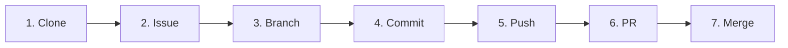

# 부록 A. 명령어 치트시트

세션 슬라이드 20의 7단계 사이클 그대로 묶었어요. 출력해서 모니터 옆에 붙여두시면 좋아요.

---

## 한 사이클 7단계



---

## 1. Clone — 원격 가져오기

```bash
# 원격 저장소를 내 컴퓨터로 복사
git clone <URL>

# 폴더 이름 지정해서 복사
git clone <URL> <폴더이름>

# 원격 확인
git remote -v
```

## 2. Issue — GitHub 웹에서

명령어 없음. GitHub 레포의 **Issues** 탭 → **New issue**.

## 3. Branch — 가지 뻗기

```bash
# 새 가지 만들면서 그쪽으로 이동
git switch -c feat/#1-login-form

# 이미 있는 가지로 이동
git switch main

# 현재 가지 확인
git branch
git branch -a              # 원격 가지까지

# 가지 삭제 (머지된 것만)
git branch -d <가지이름>

# 가지 강제 삭제
git branch -D <가지이름>

# 원격 가지 삭제
git push origin --delete <가지이름>
```

## 4. Commit — 스냅샷 찍기

```bash
# 변경 상태 확인
git status

# 변경 내용 자세히 보기
git diff                    # 아직 stage 안 한 변경
git diff --staged           # stage된 변경

# Working → Staging
git add <파일>
git add .                   # 모두

# Staging → Local Repository
git commit -m "feat: 로그인 폼 추가"

# Stage에서 빼기
git restore --staged <파일>

# Working 변경 버리기 (조심!)
git restore <파일>

# 최근 커밋 메시지 수정 (push 전만)
git commit --amend -m "새 메시지"

# 로그 보기
git log --oneline
git log --oneline --graph --all
```

## 5. Push — 원격으로 올리기

```bash
# 첫 push (브랜치 추적 설정 -u)
git push -u origin <브랜치>

# 그다음부터
git push

# 원격 변경 가져오기
git pull
git pull --rebase           # 머지 커밋 없이

# 원격에서 가져오기만 (merge 안 함)
git fetch
git fetch --prune           # 원격에서 사라진 가지 정리
```

## 6. PR — GitHub 웹에서

명령어 없음. push 후 GitHub 노란 배너의 **Compare & pull request**.

본문에 `Closes #1` 적기 → Issue 자동 닫힘.

## 7. Merge — GitHub 웹에서

머지 버튼 옆 드롭다운 → **Squash and merge** → 머지 후 **Delete branch**.

머지된 후 로컬 정리:
```bash
git switch main
git pull
git branch -d <머지된-가지>
git fetch --prune
```

---

## 트러블슈팅 명령

| 상황 | 명령 |
| --- | --- |
| `git pull` 충돌 | VSCode 마커 해결 → `git add` → `git commit` |
| `git pull` 자체 취소 | `git merge --abort` |
| 커밋 통째로 안전 취소 | `git revert <SHA>` |
| 작업 임시 보관 | `git stash` → `git stash pop` |
| stash 목록 | `git stash list` |
| 잘못된 가지에 커밋 (push 전) | `git reset --soft HEAD~1` → `git stash` → 올바른 가지 → `git stash pop` |
| 인증 캐시 초기화 (macOS) | Keychain Access → `github.com` 삭제 |
| 인증 캐시 초기화 (Windows) | 자격 증명 관리자 → `git:https://github.com` 삭제 |

---

## 설정 명령 (처음 한 번만)

```bash
git config --global user.name "본인 이름"
git config --global user.email "github-이메일"
git config --global init.defaultBranch main
git config --global core.editor "code --wait"   # VSCode를 기본 에디터로

# 확인
git config --global --list
```

---

## 위험 명령 — ⚠️ 이 자료에서 권장하지 않음

이 명령들이 필요해 보이면 [03-02 안전한 되돌리기](../03-자주-막히는-순간/02-안전한-되돌리기.md) 끝의 **🚧 멘토/팀에 물어보기** 박스 참고. 본인 손으로 하지 마세요.

- `git push --force` / `git push -f`
- `git reset --hard`
- `git rebase -i`
- `git cherry-pick`
- `git reflog`

---

### 💡 한 줄 요약

7단계 순서대로 외워두고, 트러블슈팅은 5~6개만 손에 익히면 부트캠프 4주는 충분.

### 📚 더 깊이 보기

- Git 공식 — [git-scm.com/docs](https://git-scm.com/docs)
- GitHub 공식 — [Git cheat sheet](https://education.github.com/git-cheat-sheet-education.pdf) (영문 PDF)
- 위키독스 — *부록. GitHub CLI(gh)* (gh 명령 모음)
- Pro Git — *부록 C. Git 명령어* → [git-scm.com/book/ko/v2](https://git-scm.com/book/ko/v2)
