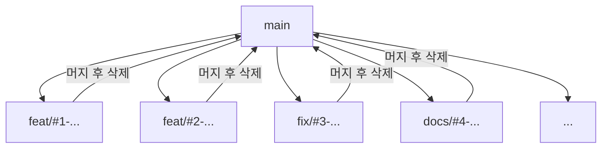

# 부록 C. 브랜치 네이밍 한 장

이 자료가 권장하는 패턴 한 장.

---

## 권장 패턴

```
<type>/#<이슈번호>-<짧은-설명>
```

- `<type>` — 커밋 컨벤션과 동일한 7종 (`feat`, `fix`, `docs`, `style`, `refactor`, `test`, `chore`)
- `#<이슈번호>` — 연결된 GitHub Issue 번호. **이게 핵심.** Issue 와 1:1로 매핑돼야 추적이 쉬워요
- `<짧은-설명>` — 영문 소문자 + 하이픈. 보통 3~5단어

---

## 예시 모음

| Type | 예시 |
| --- | --- |
| `feat` | `feat/#3-login-form`, `feat/#7-signup-validation` |
| `fix` | `fix/#12-csv-encoding`, `fix/#18-login-redirect` |
| `docs` | `docs/#5-api-readme`, `docs/#9-contributing-guide` |
| `refactor` | `refactor/#22-extract-auth-service`, `refactor/#30-rename-utils` |
| `test` | `test/#15-auth-spec`, `test/#21-payment-e2e` |
| `chore` | `chore/#8-update-deps`, `chore/#14-eslint-rules` |

---

## 좋은 이름 vs 나쁜 이름

| ✅ 좋은 예 | ❌ 나쁜 예 |
| --- | --- |
| `feat/#3-login-form` | `login` (어떤 작업인지 모호) |
| `fix/#12-csv-encoding` | `bug` (어떤 버그?) |
| `docs/#5-api-readme` | `readme` (전체 readme? 어떤 부분?) |
| `refactor/#22-extract-auth-service` | `cleanup` (무엇을 정리?) |
| `feat/#7-signup-validation` | `kim-branch` (개인 이름 = 안 좋은 패턴) |

### 좋은 이름의 공통점

- `<type>` 으로 한눈에 작업 성격
- `#이슈번호` 로 어느 Issue 와 연결됐는지 즉시 추적
- 짧은 설명으로 무엇을 하는지 힌트

### 나쁜 이름의 공통점

- type 누락
- 이슈 번호 누락 → 어느 Issue 와 관련된 작업인지 잃어버림
- 개인 이름 (`kim-branch`) — 누구 가지인지는 GitHub UI 가 알려줘요

---

## 변형 — 팀 컨벤션으로 합의 가능

부트캠프 팀이 다른 변형을 골라도 됩니다. **팀 안에서 통일** 만 되면 OK.

| 변형 | 예시 | 특징 |
| --- | --- | --- |
| 이 자료 권장 ⭐ | `feat/#3-login-form` | 슬래시 + 해시 + 하이픈 |
| 슬래시 없이 | `feat-3-login-form` | 일부 도구에서 슬래시 처리 까다로울 때 |
| 슬래시 두 번 | `feat/3/login-form` | 도구가 슬래시로 폴더처럼 표시 |
| 언더스코어 | `feat_3_login_form` | 시각적 통일감 |
| GitHub Issue 자동 패턴 | `3-login-form` | GitHub에서 Issue → "Create a branch" 버튼이 자동 생성하는 형식 |

> 💡 **GitHub의 Issue → Create a branch 버튼:** Issue 페이지 우측 사이드바의 **Development** 섹션. 클릭하면 `<번호>-<제목>` 형식으로 자동 생성 + Issue 자동 연결. 편하지만 `<type>` 이 빠져요. 팀이 자동 생성 후 이름 살짝 바꿔 쓰는 패턴도 흔합니다.

---

## 일관성을 위한 검사 도구 (선택)

브랜치 이름을 자동으로 검증하고 싶다면 Git hook을 쓰면 됩니다. 부트캠프 4주에 굳이 필요하진 않아요.

```bash
# .git/hooks/pre-push 에 한 줄 (수동 설정 시)
# 형식 안 맞으면 push 거부
```

자동화는 [husky](https://typicode.github.io/husky/), [commitlint](https://commitlint.js.org/) 같은 도구가 흔합니다. 부트캠프 후속 학습 거리.

---

## 부트캠프 4주의 흐름

각 Issue 마다 하나의 가지가 생기고, 머지 후 가지는 삭제됩니다. **4주 동안 본인이 만든 가지가 30~50개** 정도 될 수 있어요.



가지 이름은 한순간의 라벨이라고 생각하시면 부담이 줄어요. 너무 고민하지 마시고, 위 패턴을 그대로 따라가시면 됩니다.

---

### 💡 한 줄 요약

`<type>/#<이슈번호>-<설명>` — 부트캠프 4주는 이 한 패턴이면 충분. 팀이 변형을 합의해도 OK, 통일만 되면.

### 📚 더 깊이 보기

- 부록 — [B 커밋 컨벤션 한 장](./B-커밋-컨벤션-한-장.md) (같은 type 체계)
- 위키독스 — *2.8.1 로컬 저장소에서 브랜치 생성·수정·병합* (브랜치 이름 변경 등)
- Atlassian — [Git Branching Strategies](https://www.atlassian.com/git/tutorials/comparing-workflows) (워크플로 비교 — 더 큰 그림)
