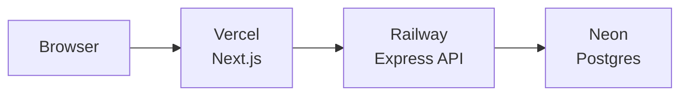
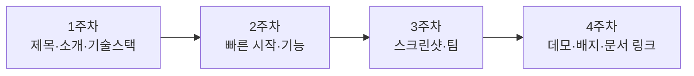

# 부록 F. README 작성법

> 부트캠프 4주 프로젝트의 얼굴이에요. **첫 방문자가 30초 안에 "이 프로젝트가 뭐고, 어떻게 돌리나"** 를 알 수 있어야 합니다.
> PR/Issue 본문이 **팀 내부**용이라면, README 는 **외부 독자** (멘토·평가자·다른 팀·면접관) 용입니다.

📎 GitHub 공식 — [About READMEs](https://docs.github.com/en/repositories/managing-your-repositorys-settings-and-features/customizing-your-repository/about-readmes)

---

## 0. 왜 README 가 중요한가요

부트캠프 4주가 끝나면 이 레포는 **여러분의 이력서 자산**이 됩니다. 면접관·다음 기수 멘티·미래의 본인이 펴봤을 때 첫인상이 이 한 페이지에서 결정돼요.

| 좋은 README 가 주는 것 | 없을 때 |
| --- | --- |
| 30초 안에 프로젝트 파악 | 코드 디렉토리부터 헤매다 닫음 |
| 5분 안에 로컬에서 실행 가능 | 동작도 못 보고 평가됨 |
| 팀 구성·역할 명시 → 기여도 인정 | 누가 무엇 했는지 모름 |
| 데모/스크린샷 → 면접관 시선 잡기 | 텍스트만으로는 임팩트 부족 |

---

## 1. 5섹션 골격 — 부트캠프 권장 양식

다음을 그대로 복붙해서 빈칸만 채우시면 됩니다.

````markdown
# 프로젝트 이름

> 한 줄 소개 — 이 프로젝트가 무엇이고, 누구를 위한 것인지

[](https://opensource.org/licenses/MIT)
[](https://react.dev/)

---

## 📸 데모


🔗 **라이브 데모:** [your-project.vercel.app](https://your-project.vercel.app)

---

## ✨ 주요 기능

- 🎯 기능 1 — 한 줄 설명
- 🎯 기능 2 — 한 줄 설명
- 🎯 기능 3 — 한 줄 설명

---

## 🚀 빠른 시작

### 사전 요구사항

- Node.js 20.x 이상
- pnpm 9.x 이상 (또는 npm 10.x)

### 설치 및 실행

```bash
# 1. 클론
git clone https://github.com/<owner>/<repo>.git
cd <repo>

# 2. 의존성 설치
pnpm install

# 3. 환경 변수 설정 (.env.example 복사 후 채우기)
cp .env.example .env

# 4. 개발 서버 실행
pnpm dev
```

브라우저에서 `http://localhost:3000` 접속.

---

## 🛠 기술 스택

| 영역 | 사용 기술 |
| --- | --- |
| Frontend | React 18, TypeScript, Tailwind CSS |
| Backend  | Node.js, Express, PostgreSQL |
| Infra    | Vercel (FE), Railway (BE), Neon (DB) |
| 협업     | GitHub, Slack, Notion |

---

## 👥 팀

| 이름 | 역할 | GitHub |
| --- | --- | --- |
| 이정 (Leo) | Backend, DB | [@leo](https://github.com/leo) |
| 김앨리스 | Frontend, UI | [@alice](https://github.com/alice) |
| 박밥 | DevOps, 인증 | [@bob](https://github.com/bob) |
| 최캐롤 | PM, QA | [@carol](https://github.com/carol) |

---

## 📄 라이선스

MIT © 2026 팀 이름
````

이 양식이 부트캠프 4주에 필요한 모든 걸 담고 있어요. 더 화려하게 만들 필요 없습니다.

---

## 2. 섹션별 작성 팁

### 한 줄 소개

3가지를 한 문장에 담으세요:
- **무엇** (What) — 어떤 종류의 프로젝트
- **누구** (Who) — 타깃 사용자
- **차별점** (Why) — 다른 비슷한 것과 무엇이 다른가

| ✅ 좋은 예 | ❌ 나쁜 예 |
| --- | --- |
| 부트캠프 멘티들이 4주 협업 진척을 한눈에 볼 수 있는 칸반 보드 | 협업 도구 |
| 의류 사진 한 장으로 비슷한 옷을 5개 추천하는 모바일 웹 | 옷 추천 사이트 |
| 학생 5명이 함께 풀 수 있는 코딩 퀴즈 라이브 룸 | 퀴즈 앱 |

### 데모 / 스크린샷

**텍스트보다 100배 효과적.** 면접관이 가장 먼저 보는 부분.

- **데모 GIF** — 5~10초 짧게. 가장 자랑할 만한 기능 1~2개
- **라이브 데모 링크** — Vercel/Netlify/Railway 같은 무료 배포로 한 번이라도 띄워두기
- **스크린샷** — GIF 없으면 3장 정도 (메인/상세/모바일)

이미지는 `docs/` 또는 `assets/` 폴더에 두고 상대 경로로 첨부.

> 💡 GIF 만드는 도구: macOS — Kap, Gifski / Windows — ScreenToGif / 크로스 — LICEcap. 모두 무료.

### 주요 기능

3~5개로 좁히세요. 너무 많으면 임팩트가 흐려져요. 이모지를 적당히 쓰면 가독성이 살아납니다.

### 빠른 시작 — **이 부분이 가장 중요**

> 부트캠프 4주의 README 80% 가 이 부분에서 실패합니다.

**테스트 방법:** 자기 컴퓨터에서 `rm -rf <폴더>` 후 README 의 명령어만 그대로 따라 쳤을 때 동작해야 합니다.

체크리스트:
- [ ] Node/Python 버전 명시
- [ ] `.env.example` 파일 제공 + 어떤 변수가 필요한지 README 에 명시
- [ ] 4~6 줄 안에 실행까지
- [ ] 외부 서비스 (DB·API 키) 가 필요하면 발급 절차 한 줄

### 기술 스택

표로 정리하면 한눈에 들어와요. **버전까지 명시**하는 게 신뢰감을 줘요.

### 팀

각 팀원의 GitHub 핸들을 링크. 면접관이 본인 기여를 확인하러 가요.

---

## 3. 배지(Badge) 한 줄 가이드

README 상단에 배지를 두면 시각적 신뢰감이 올라가요. 너무 많으면 광고처럼 보이니 **3~5개로 제한**.

### 자주 쓰는 배지

| 배지 | 의미 | 만드는 법 |
| --- | --- | --- |
| **License** | 라이선스 종류 | shields.io 정적 배지 |
| **Build** | CI 상태 (통과/실패) | GitHub Actions 자동 |
| **Version** | 현재 버전 | shields.io 정적 또는 npm 동적 |
| **Stars** | GitHub 별 개수 | shields.io 동적 |
| **Tech** | 주요 기술 | shields.io 정적 (브랜드 컬러) |

### Static badge — shields.io

자유로운 텍스트 + 색.

```
https://img.shields.io/badge/<label>-<message>-<color>
```

예:
```markdown


```

띄어쓰기는 `%20` 으로 인코딩. 색은 [shields.io](https://shields.io) 에서 미리보기.

### Dynamic GitHub badge

레포의 실시간 정보 (스타·이슈·PR·라이선스 자동 감지).

```
https://img.shields.io/github/<metric>/<owner>/<repo>
```

예:
```markdown


```

---

## 4. (선택) 더 두면 좋은 섹션

부트캠프 4주의 5섹션이 기본. 여유 있으면 다음도 매력적이에요.

### 📚 문서 링크

```markdown
## 문서

- [CONTRIBUTING.md](./CONTRIBUTING.md) — 협업 가이드
- [API 문서](./docs/api.md) 또는 Swagger 링크
- [회고](./docs/retrospective.md) — 4주 동안 배운 것
```

### 🗺️ 아키텍처 다이어그램

mermaid 로 그릴 수 있어요. GitHub 가 자동 렌더링.

````markdown
## 아키텍처


````

### 🧪 테스트

```markdown
## 테스트

```bash
pnpm test           # 단위 테스트
pnpm test:e2e       # E2E
pnpm test:coverage  # 커버리지
```
```

### 🗓️ 로드맵 / 진행 상황

```markdown
## 로드맵

- [x] 1주차 — 인증, 메인 페이지
- [x] 2주차 — CRUD, 댓글
- [ ] 3주차 — 알림, 검색
- [ ] 4주차 — 배포, 데모 데이
```

---

## 5. 좋은 README vs 나쁜 README

### 좋은 예 ✅

- 한 줄 소개에 **무엇/누구/차별점** 다 들어 있음
- 데모 GIF 또는 라이브 링크 위쪽 노출
- 빠른 시작 명령어 4~6줄, 그대로 동작
- 팀원 GitHub 링크
- 라이선스 명시
- 5섹션 안에서 끝남 (스크롤 부담 적음)

### 나쁜 예 ❌

- 한 줄 소개에 "토이 프로젝트", "공부용" — 매력 0
- 스크린샷 없음
- 빠른 시작에 `.env` 변수 안내 없음 → 실행 실패
- 미완성 섹션을 `TODO` 로 남김 → 신뢰 깎임
- 끝없이 긴 단락, 표 없음, 이미지 없음

### 가장 흔한 사망 패턴 5가지

1. **데모 없음** — 면접관이 직접 띄워봐야 함 (안 띄움)
2. **`.env.example` 없음** — 빠른 시작 명령이 실패
3. **팀 섹션 빠짐** — 누가 무엇 했는지 모름
4. **3줄짜리 README** — 이력서 자산이 안 됨
5. **README 가 본인 컴퓨터에서만 동작** — 새 컴퓨터에서 빠른 시작이 깨짐

---

## 6. 부트캠프 4주 동안 README 를 키우는 방법

처음부터 완성판을 쓰지 마세요. **단계별로** 살을 붙입니다.



### 1주차

```markdown
# 프로젝트 이름
> 한 줄 소개

## 기술 스택
표
```

### 2주차

기능 목록 + 빠른 시작 + 환경 변수.

### 3주차

스크린샷 1~2장 + 팀 표.

### 4주차

데모 GIF + 라이브 데모 + 배지 + 문서 링크.

---

## 7. 라이선스 — 4주 프로젝트는 보통 MIT

학습 레포는 거의 항상 MIT 로 충분. 한 줄로 적기:

```markdown
## 📄 라이선스
MIT © 2026 팀 이름
```

레포 루트에 `LICENSE` 파일도 함께 두세요 ([01-01 레포 만들기](../01-한사이클-혼자-돌려보기/01-레포-만들기.md) 에서 GitHub 의 "Choose a license" 옵션으로 자동 생성 가능).

---

## 🩺 막힐 때

<details>
<summary><b>데모 GIF 가 너무 무거워서 GitHub 가 잘 안 보여줘요</b></summary>

GitHub 의 첨부 이미지 권장 크기는 <b>10MB 이하</b>. 5MB 이상이면 ezgif 같은 도구로 압축하거나, MP4 동영상으로 첨부 (GitHub 가 inline 재생 지원).

</details>

<details>
<summary><b>이미지를 첨부했는데 README 에서 깨져 보여요</b></summary>

상대 경로 확인. <code>./docs/demo.gif</code> 같이 점부터 시작. 절대 경로 (예: <code>/docs/demo.gif</code>) 는 GitHub web 에서는 동작하지만 일부 도구에서 깨질 수 있어요.

</details>

<details>
<summary><b>mermaid 다이어그램이 안 렌더링 돼요</b></summary>

GitHub web 은 자동 지원. Obsidian / 일부 마크다운 뷰어는 플러그인이 필요. 안 보이면 <a href="https://mermaid.live">mermaid.live</a> 에서 미리 렌더링 후 PNG 로 첨부하는 것도 방법.

</details>

<details>
<summary><b>배지를 너무 많이 달았더니 광고 같아 보여요</b></summary>

3~5개로 줄이세요. 우선순위: <b>License > Build/CI > Tech stack 1~2개</b>. 별 개수·다운로드는 100+ 이전엔 안 다는 게 차라리 깔끔.

</details>

<details>
<summary><b>한국어 README 와 영어 README 를 둘 다 두고 싶어요</b></summary>

루트의 README.md 를 메인으로 두고, 다른 언어는 <code>README.en.md</code> 식으로 두는 게 일반적. 상단에 언어 선택 링크.

```markdown
[English](./README.en.md) | 한국어
```

</details>

---

## ✅ 체크포인트

- [ ] 한 줄 소개에 "무엇/누구/차별점" 3가지 다 있는가
- [ ] 데모 GIF 또는 라이브 데모 링크가 README 상단 1/3 안에 있는가
- [ ] 빠른 시작 명령어를 새 컴퓨터에서 그대로 따라 쳤을 때 동작하는가
- [ ] `.env.example` 이 레포에 있고 README 에서 안내되는가
- [ ] 팀원 표에 GitHub 핸들 링크가 있는가
- [ ] 배지는 3~5개로 제한했는가
- [ ] 라이선스가 명시되어 있는가 (`LICENSE` 파일 + README 한 줄)

---

### 💡 한 줄 요약

5섹션(소개·데모·기능·빠른시작·팀) 골격으로 시작해서, 4주 동안 단계별로 살 붙이기. 빠른 시작은 **새 컴퓨터에서 동작하는지** 가 핵심.

### 📚 더 깊이 보기

- GitHub 공식 — [About READMEs](https://docs.github.com/en/repositories/managing-your-repositorys-settings-and-features/customizing-your-repository/about-readmes)
- GitHub 공식 — [Quickstart for writing on GitHub](https://docs.github.com/en/get-started/writing-on-github/quickstart-for-writing-on-github)
- [shields.io](https://shields.io) — 배지 생성기
- [Choose a License](https://choosealicense.com/) — 라이선스 비교 (MIT/Apache/GPL 등)
- [Awesome README](https://github.com/matiassingers/awesome-readme) — 잘 만든 README 모음 (영문)
- [Make a README](https://www.makeareadme.com/) — README 작성 가이드 (영문, 간결)
- 부록 — [D PR 템플릿 모음](./D-PR-템플릿-모음.md), [E Issue 템플릿 모음](./E-Issue-템플릿-모음.md)
